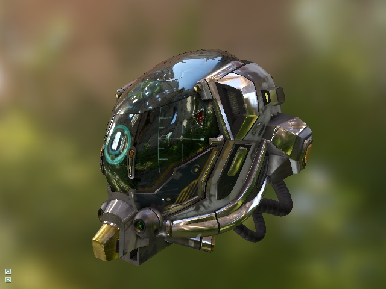
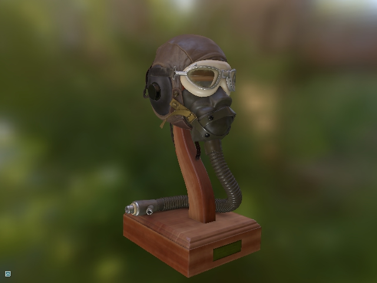
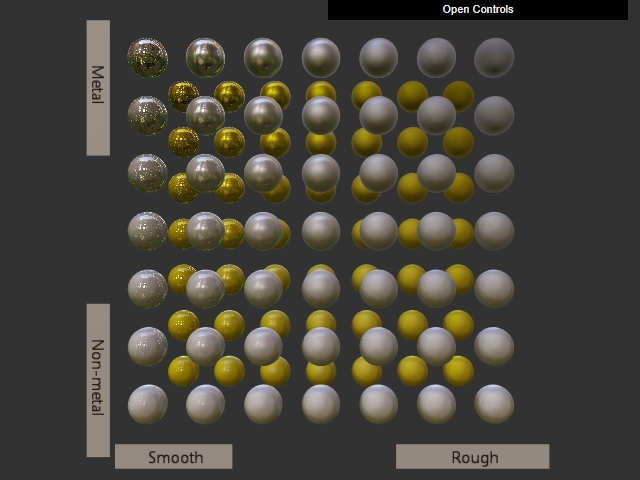
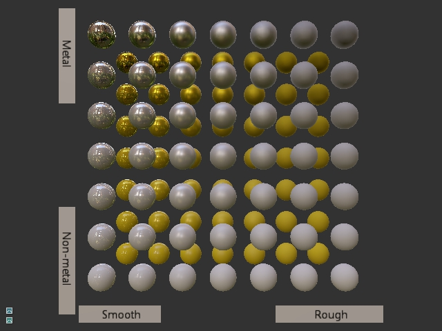

# Physially-Based GLTF Renderer

A physially-based GLTF2.0 renderer with image-based lighting. 





The renderer uses the refernce
[GLTF2.0 lighting model](https://github.com/KhronosGroup/glTF/blob/master/specification/2.0/README.md#appendix-b-brdf-implementation).

|[Khronos GLTF viewer][1]| Diligent Engine        |
|------------------------|------------------------|
|||


The implementation is based on [GLTF sample viewer][1] from 
[Khronos Group](https://github.com/KhronosGroup/glTF-Sample-Viewer) and
[Vulkan-glTF-PBR][2] project by [Sascha Willems](https://github.com/SaschaWillems).

## Using the renderer

To initialize the renderer, populate `GLTF_PBR_Renderer::CreateInfo` structure and
create an instance of `GLTF_PBR_Renderer` class:

```cpp
auto BackBufferFmt  = m_pSwapChain->GetDesc().ColorBufferFormat;
auto DepthBufferFmt = m_pSwapChain->GetDesc().DepthBufferFormat;
GLTF_PBR_Renderer::CreateInfo RendererCI;
RendererCI.RTVFmt         = BackBufferFmt;
RendererCI.DSVFmt         = DepthBufferFmt;
RendererCI.AllowDebugView = true;
RendererCI.UseIBL         = true;
RendererCI.FrontCCW       = true;
m_GLTFRenderer.reset(new GLTF_PBR_Renderer(m_pDevice, m_pImmediateContext, RendererCI));
```

Note that the front face is set to counter-clockwise because in GLTF, y axis points down and
we need to invert it, which will reverse the winding order.

The renderer generates all required look-up tables at run-time. For image-based lighting,
it pre-computes irradiance cube map for diffuse component and pre-filtered environment map
for specular component:

```cpp
RefCntAutoPtr<ITexture> EnvironmentMap;
CreateTextureFromFile("textures/papermill.ktx", TextureLoadInfo{"Environment map"}, m_pDevice, &EnvironmentMap);
m_EnvironmentMapSRV = EnvironmentMap->GetDefaultView(TEXTURE_VIEW_SHADER_RESOURCE);
m_GLTFRenderer->PrecomputeCubemaps(m_pDevice, m_pImmediateContext, m_EnvironmentMapSRV);
```

The renderer itself does not implement any loading functionality. Use
[Asset Loader](https://github.com/DiligentGraphics/DiligentTools/tree/master/AssetLoader) to load GLTF
models. When model is loaded, it is important to call `InitializeResourceBindings()` method
to let the renderer intiailize internal shader resource binding objects:

```cpp
m_Model.reset(new GLTF::Model(m_pDevice, m_pImmediateContext, Path));
m_GLTFRenderer->InitializeResourceBindings(*m_Model, m_CameraAttribsCB, m_LightAttribsCB);
```

To render the model, prepare `GLTF_PBR_Renderer::RenderInfo` structure and call
`Render()` method:

```cpp
m_GLTFRenderer->Render(m_pImmediateContext, *m_Model, m_RenderParams);
```

For more details, see [GLTFViewer.cpp](https://github.com/DiligentGraphics/DiligentSamples/blob/master/Samples/GLTFViewer/src/GLTFViewer.cpp).

# References

[GLTF Sampler Viewer][1]

[Vulkan-glTF-PBR][2]

[GLTF2.0 Format Specification][3]

[1]: https://github.com/KhronosGroup/glTF-Sample-Viewer
[2]: https://github.com/SaschaWillems/Vulkan-glTF-PBR
[3]: https://github.com/KhronosGroup/glTF
