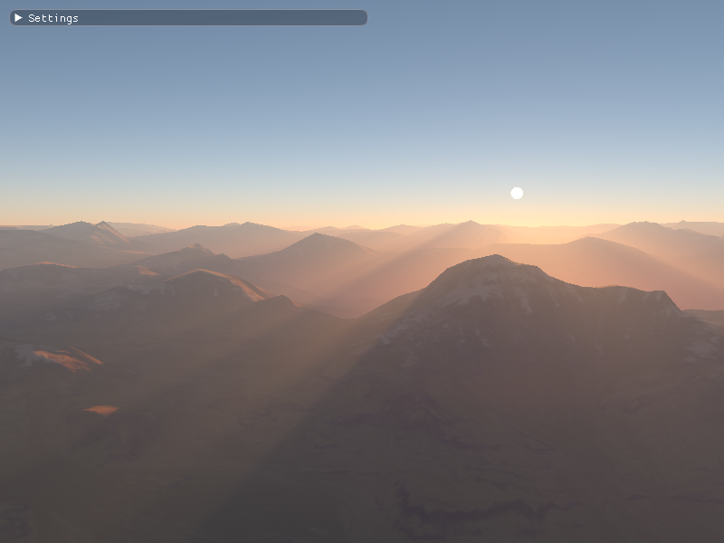
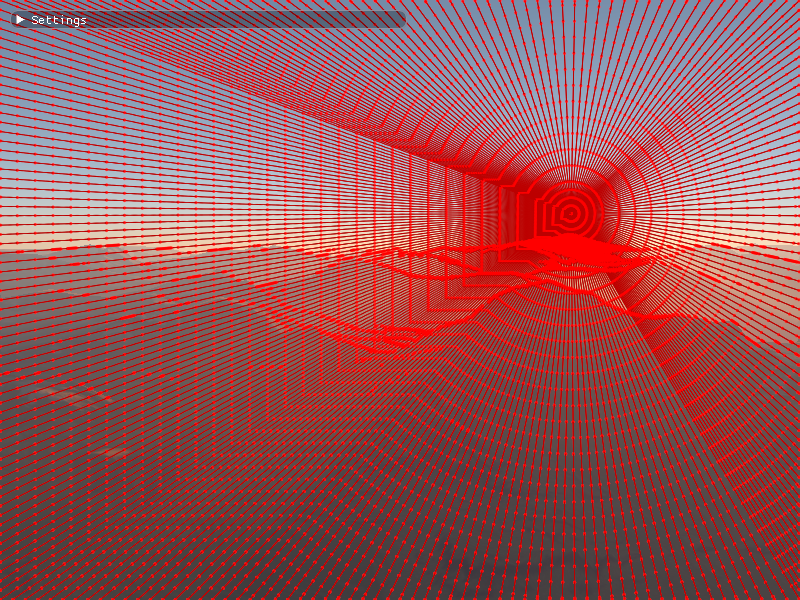

# EpipolarLightScattering



This post-processing effect renders realistic high-quality light scattering effects and is 
based on this [article by Intel](https://software.intel.com/en-us/blogs/2013/09/19/otdoor-light-scattering-sample-update).
The effect works by smartly placing expensive ray-marching samples along the epipolar lines
that start at the light source and interpolating the radiance between these samples.



## Parameters 

`EpipolarLightScatteringAttribs` structure 
The following parameters control the effect

* uiNumEpipolarSlices - the total number of epipolar slices (lines). For high quality effect,
                        set this value to (Screen Width + Screen Height)/2
* uiMaxSamplesInSlice - Maximum number of samples on a single epipolar line.
                        When epipolar light is short, the actual number of samples
                        may be lower. For high quality effect, set this value to max(Screen Width, Screen Height)/2. 
* uiInitialSampleStepInSlice - Initial ray marching sample spacing on an epipolar line. 
                               Additional samples are added at discontinuities.
* uiEpipoleSamplingDensityFactor - Sample density scale near the epipole where inscattering changes rapidly.
                                   Note that sampling near the epipole is very cheap since only a few steps
                                   required to perform ray marching.
* fRefinementThreshold - Sampling refinement threshold that controls detection of discontinuities. Smaller values
                         produce more samples and higher quality, but at a higher performance cost.
* bShowSampling    - Whether to show epipolar sampling.
* bCorrectScatteringAtDepthBreaks - Whether to correct inscattering at depth discontinuities. Improves quality
                                    for additional cost. It may be preferrable to increase the number of slices
                                    and or maximum number of samples on an epipolar line instead.
* bShowDepthBreaks  -  Whether to display pixels which are classified as depth discontinuities and which
                       will be corrected. Only has effect when bCorrectScatteringAtDepthBreaks is TRUE.
* bShowLightingOnly - Whether to show lighting only
* bOptimizeSampleLocations - Optimize sample locations to avoid oversampling. This should generally be TRUE.
* bEnableLightShafts  - Wether to enable light shafts or render unshadowed inscattering.
                        Setting this to FALSE increases performance, but reduces visual quality.
* uiInstrIntegralSteps  - Number of inscattering integral steps taken when computing unshadowed inscattering
                          Default value is OK and should not be changed.
* f2ShadowMapTexelSize  - Size of the shadowmap texel (1/width, 1/height)
* uiMaxSamplesOnTheRay  - Maximum number of ray marching samples on a single ray. Typically this value should match the maximum 
                          shadow map cascade resolution. Using lower value will improve performance but may result
                          in moire patterns. Note that in most cases singificantly less samples are actually taken.
* uiMinMaxShadowMapResolution - Defines the number of samples at the lowest level of min-max binary tree
                                and should match the maximum cascade shadow map resolution.
* iNumCascades - Number of shadow map cascades
* iFirstCascadeToRayMarch  -  First cascade to use for ray marching. Usually first few cascades are small, and ray
                              marching them is inefficient.
* fMaxShadowMapStep -  Cap on the maximum shadow map step in texels.
* bUse1DMinMaxTree  -  Whether to use 1D min/max binary tree optimization. This improves
                       performance for higher shadow map resolution. Test it.
* bIs32BitMinMaxMipMap - Whether to use 32-bit float or 16-bit UNORM min-max binary tree. Usually 16-bit UNORM is OK.
* uiLightSctrTechnique - Light scattering evaluation technique. The following two methods are available: epipolar and brute-force.
                         Brute force light scattering performs expensive ray marching for every screen pixel. This method
                         can be used as the quality reference.
* uiCascadeProcessingMode  - Shadow map cascades processing mode.
* uiRefinementCriterion  - Epipolar sampling refinement criterion. The two options are depth difference and scattering difference.
                           Scattering difference is generally preferable way.
* uiSingleScatteringMode - Single scattering evaluation mode. The following three methods are available:
  * None - no single scattering.
  * Integration (default) - evaluate single scattering with numerical integration.
  * Look-up table - use precomputed single-scattering look-up table.
* uiMultipleScatteringMode - Higher-order scattering evaluation mode. The following three options are available:
  * None - no multiple scattering.
  * Unoccluded (default) - evaluate multiple scattering without shadowing.
  * Occluded - evaluate multiple scattering taking shadowing into account similar to single scattering.
* uiExtinctionEvalMode - Atmospheric extinction evaluation mode.
* bUseCustomSctrCoeffs - Whether to use custom scattering coefficients.
* fAerosolDensityScale - Aerosol density scale to use for scattering coefficient computation.
* fAerosolAbsorbtionScale - Aerosol absorbtion scale to use for scattering coefficient computation.
* f4CustomRlghBeta - Custom Rayleigh coefficients.
* f4CustomMieBeta  - Custom Mie coefficients.

## Integration

The effect requires the following data:
* Shader and render target views of the original color buffer
* Shader and depth-stencil views of the original depth buffer
* Shadow map
* Light and color attributes

The code snippet below shows how to use the epipolar light scattering post-processing effect.
For the full soure code, see [Atmospheric scattering sample](https://github.com/DiligentGraphics/DiligentSamples/tree/master/Samples/Atmosphere).

```cpp
EpipolarLightScattering::FrameAttribs FrameAttribs;

FrameAttribs.pDevice        = m_pDevice;
FrameAttribs.pDeviceContext = m_pImmediateContext;
FrameAttribs.dElapsedTime   = m_fElapsedTime;
FrameAttribs.pLightAttribs  = &LightAttrs;
FrameAttribs.pCameraAttribs = &CamAttribs;

m_PPAttribs.iNumCascades = m_TerrainRenderParams.m_iNumShadowCascades;
m_PPAttribs.fNumCascades = (float)m_TerrainRenderParams.m_iNumShadowCascades;

FrameAttribs.pcbLightAttribs  = m_pcbLightAttribs;
FrameAttribs.pcbCameraAttribs = m_pcbCameraAttribs;

m_PPAttribs.fMaxShadowMapStep = static_cast<float>(m_uiShadowMapResolution / 4);
        
m_PPAttribs.f2ShadowMapTexelSize = float2( 1.f / static_cast<float>(m_uiShadowMapResolution), 1.f / static_cast<float>(m_uiShadowMapResolution) );
m_PPAttribs.uiMaxSamplesOnTheRay = m_uiShadowMapResolution;
// During the ray marching, on each step we move by the texel size in either horz 
// or vert direction. So resolution of min/max mipmap should be the same as the 
// resolution of the original shadow map
m_PPAttribs.uiMinMaxShadowMapResolution    = m_uiShadowMapResolution;
m_PPAttribs.uiInitialSampleStepInSlice     = std::min( m_PPAttribs.uiInitialSampleStepInSlice, m_PPAttribs.uiMaxSamplesInSlice );
m_PPAttribs.uiEpipoleSamplingDensityFactor = std::min( m_PPAttribs.uiEpipoleSamplingDensityFactor, m_PPAttribs.uiInitialSampleStepInSlice );

FrameAttribs.ptex2DSrcColorBufferSRV = m_pOffscreenColorBuffer->GetDefaultView(TEXTURE_VIEW_SHADER_RESOURCE);
FrameAttribs.ptex2DSrcColorBufferRTV = m_pOffscreenColorBuffer->GetDefaultView(TEXTURE_VIEW_RENDER_TARGET);
FrameAttribs.ptex2DSrcDepthBufferSRV = m_pOffscreenDepthBuffer->GetDefaultView(TEXTURE_VIEW_SHADER_RESOURCE);
FrameAttribs.ptex2DSrcDepthBufferDSV = m_pOffscreenDepthBuffer->GetDefaultView(TEXTURE_VIEW_DEPTH_STENCIL);
FrameAttribs.ptex2DShadowMapSRV      = m_pShadowMapSRV;
FrameAttribs.pDstRTV                 = nullptr;// mpBackBufferRTV;

// Perform the post processing
m_pLightSctrPP->PerformPostProcessing(FrameAttribs, m_PPAttribs);
```
