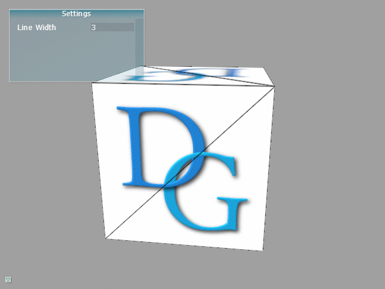
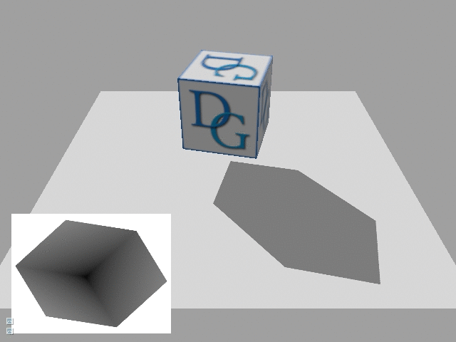
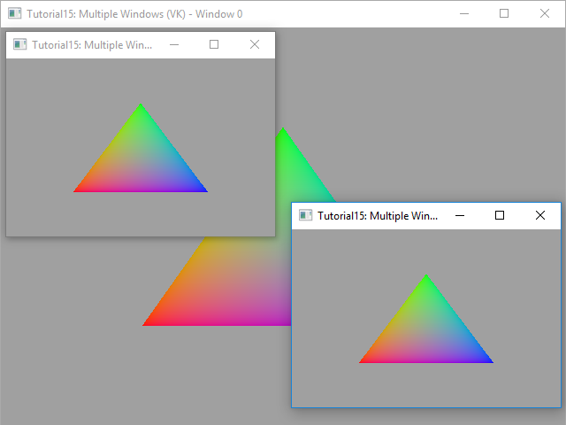
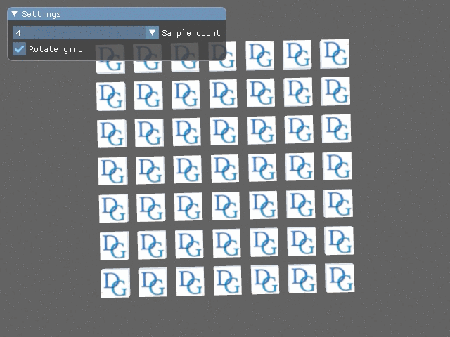
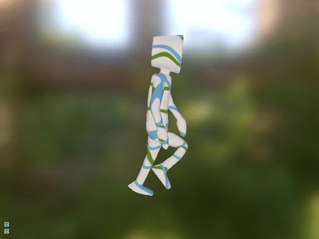
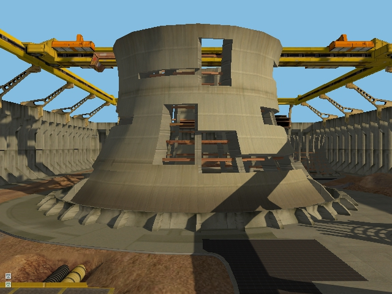
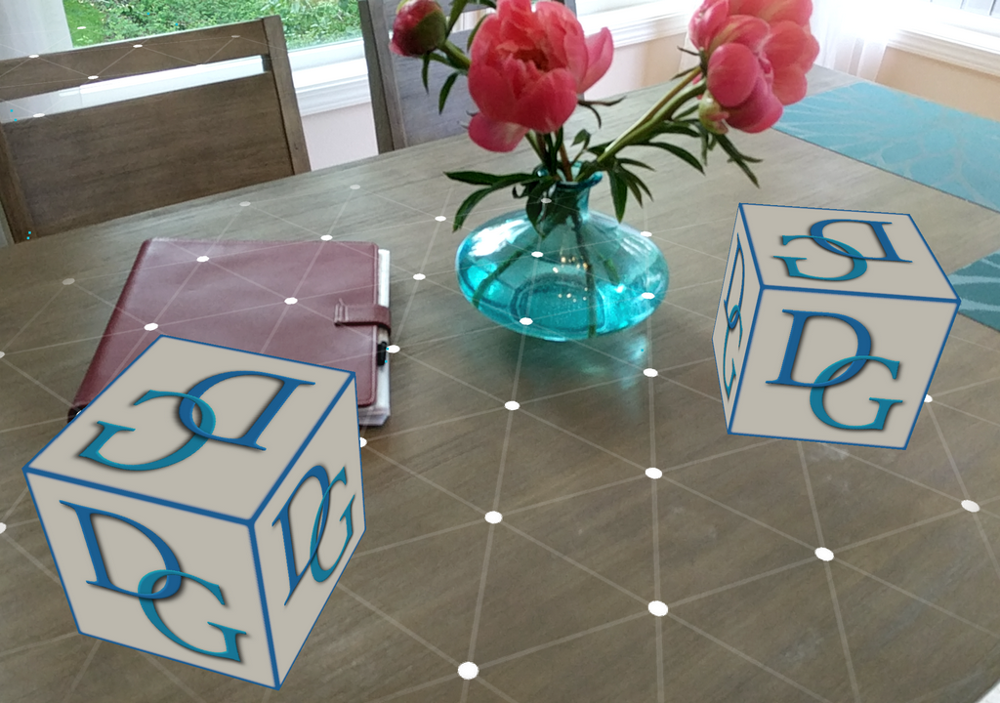

# DiligentSamples 


This module contains tutorials and sample applications intended to demonstrate the usage of [Diligent Engine](https://github.com/DiligentGraphics/DiligentEngine). The module depends on the [Core](https://github.com/DiligentGraphics/DiligentCore) and [Tools](https://github.com/DiligentGraphics/DiligentTools) submodules.

To build and run the applications in the module, please follow the [instructions](https://github.com/DiligentGraphics/DiligentEngine#build-and-run-instructions) in the master repository.

[](License.txt)
[](https://gitter.im/diligent-engine)
[](https://discord.gg/t7HGBK7)
[](https://ci.appveyor.com/project/DiligentGraphics/diligentsamples)
[](https://travis-ci.org/DiligentGraphics/DiligentSamples)
[](https://www.codacy.com/manual/DiligentGraphics/DiligentSamples?utm_source=github.com&amp;utm_medium=referral&amp;utm_content=DiligentGraphics/DiligentSamples&amp;utm_campaign=Badge_Grade)

# Table of Contents

- [Tutorials](https://github.com/DiligentGraphics/DiligentSamples#tutorials)
  - [01 - Hello Triangle](https://github.com/DiligentGraphics/DiligentSamples#tutorial-01---hello-triangle)
  - [02 - Cube](https://github.com/DiligentGraphics/DiligentSamples#tutorial-02---cube)
  - [03 - Texturing](https://github.com/DiligentGraphics/DiligentSamples#tutorial-03---texturing)
  - [03 - Texturing-C](https://github.com/DiligentGraphics/DiligentSamples#tutorial-03---texturing-c)
  - [04 - Instancing](https://github.com/DiligentGraphics/DiligentSamples#tutorial-04---instancing)
  - [05 - Texture Array](https://github.com/DiligentGraphics/DiligentSamples#tutorial-05---texture-array)
  - [06 - Multithreading](https://github.com/DiligentGraphics/DiligentSamples#tutorial-06---multithreading)
  - [07 - Geometry Shader](https://github.com/DiligentGraphics/DiligentSamples#tutorial-07---geometry-shader)
  - [08 - Tessellation](https://github.com/DiligentGraphics/DiligentSamples#tutorial-08---tessellation)
  - [09 - Quads](https://github.com/DiligentGraphics/DiligentSamples#tutorial-09---quads)
  - [10 - Data Streaming](https://github.com/DiligentGraphics/DiligentSamples#tutorial-10---data-streaming)
  - [11 - Resource Updates](https://github.com/DiligentGraphics/DiligentSamples#tutorial-11---resource-updates)
  - [12 - Render Target](https://github.com/DiligentGraphics/DiligentSamples#tutorial-12---render-target)
  - [13 - Shadow Map](https://github.com/DiligentGraphics/DiligentSamples#tutorial-13---shadow-map)
  - [14 - Compute Shader](https://github.com/DiligentGraphics/DiligentSamples#tutorial-14---compute-shader)
  - [15 - Multiple Windows](https://github.com/DiligentGraphics/DiligentSamples#tutorial-15---multiple-windows)
  - [16 - Bindless Resources](https://github.com/DiligentGraphics/DiligentSamples#tutorial-16---bindless-resources)
  - [17 - MSAA](https://github.com/DiligentGraphics/DiligentSamples#tutorial-17---msaa)
  - [18 - Queries](https://github.com/DiligentGraphics/DiligentSamples#tutorial-18---queries)
  - [19 - Render Passes](https://github.com/DiligentGraphics/DiligentSamples#tutorial-19---render-passes)
  - [20 - Mesh Shader](https://github.com/DiligentGraphics/DiligentSamples#tutorial-20---mesh-shader)
- [Samples](https://github.com/DiligentGraphics/DiligentSamples#samples)
  - [Atmospheric Light Scattering](https://github.com/DiligentGraphics/DiligentSamples#atmospheric-light-scattering-sample)
  - [GLTF Viewer](https://github.com/DiligentGraphics/DiligentSamples#gltf-viewer)
  - [Shadows](https://github.com/DiligentGraphics/DiligentSamples#shadows)
  - [Dear ImGui Demo](https://github.com/DiligentGraphics/DiligentSamples#dear-imgui-demo)
  - [Nuklear Demo](https://github.com/DiligentGraphics/DiligentSamples#nuklear-demo)
  - [Hello AR](https://github.com/DiligentGraphics/DiligentSamples#hello-ar)
- [Build and Run Instructions](https://github.com/DiligentGraphics/DiligentSamples#build-and-run-instructions)
- [License](https://github.com/DiligentGraphics/DiligentSamples#license)
- [Contributing](https://github.com/DiligentGraphics/DiligentSamples#contributing)

# Tutorials

## [Tutorial 01 - Hello Triangle](Tutorials/Tutorial01_HelloTriangle)


This tutorial shows how to render simple triangle using Diligent Engine API.


## [Tutorial 02 - Cube](Tutorials/Tutorial02_Cube)


This tutorial demonstrates how to render an actual 3D object, a cube. It shows how to load shaders from files, create and use vertex, 
index and uniform buffers.


## [Tutorial 03 - Texturing](Tutorials/Tutorial03_Texturing)


This tutorial demonstrates how to apply a texture to a 3D object. It shows how to load a texture from file, create shader resource
binding object and how to sample a texture in the shader.

## [Tutorial 03 - Texturing-C](Tutorials/Tutorial03_Texturing-C)


This tutorial is identical to Tutorial03, but is implemented using C API.


## [Tutorial 04 - Instancing](Tutorials/Tutorial04_Instancing)


This tutorial demonstrates how to use instancing to render multiple copies of one object
using unique transformation matrix for every copy.


## [Tutorial 05 - Texture Array](Tutorials/Tutorial05_TextureArray)


This tutorial demonstrates how to combine instancing with texture arrays to 
use unique texture for every instance.


## [Tutorial 06 - Multithreading](Tutorials/Tutorial06_Multithreading)


This tutorial shows how to generate command lists in parallel from multiple threads.


## [Tutorial 07 - Geometry Shader](Tutorials/Tutorial07_GeometryShader)



This tutorial shows how to use geometry shader to render smooth wireframe.


## [Tutorial 08 - Tessellation](Tutorials/Tutorial08_Tessellation)


This tutorial shows how to use hardware tessellation to implement simple adaptive terrain 
rendering algorithm.


## [Tutorial 09 - Quads](Tutorials/Tutorial09_Quads)


This tutorial shows how to render multiple 2D quads, frequently swithcing textures and blend modes.


## [Tutorial 10 - Data Streaming](Tutorials/Tutorial10_DataStreaming)


This tutorial shows dynamic buffer mapping strategy using `MAP_FLAG_DISCARD` and `MAP_FLAG_DO_NOT_SYNCHRONIZE`
flags to efficiently stream varying amounts of data to GPU.


## [Tutorial 11 - Resource Updates](Tutorials/Tutorial11_ResourceUpdates)


This tutorial demonstrates different ways to update buffers and textures in Diligent Engine and explains 
important internal details and performance implications related to each method.


## [Tutorial 12 - Render Target](Tutorials/Tutorial12_RenderTarget)


This tutorial demonstrates how to render a 3d cube into an offscreen render target and do a simple
post-processing effect.


## [Tutorial 13 - Shadow Map](Tutorials/Tutorial13_ShadowMap)



This tutorial demonstrates how to render basic shadows using a shadow map.


## [Tutorial 14 - Compute Shader](Tutorials/Tutorial14_ComputeShader)

This tutorial shows how to implement a simple particle simulation system using compute shaders.


## [Tutorial 15 - Multiple Windows](Tutorials/Tutorial15_MultipleWindows)

This tutorial demonstrates how to use Diligent Engine to render to multiple windows.




## [Tutorial 16 - Bindless Resources](Tutorials/Tutorial16_BindlessResources)

This tutorial shows how to implement bindless resources, a technique that leverages
dynamic shader resource indexing feature enabled by the next-gen APIs to significantly improve
rendering performance.


## [Tutorial 17 - MSAA](https://github.com/DiligentGraphics/DiligentSamples/tree/master/Tutorials/Tutorial17_MSAA)

This tutorial demonstrates how to use multisample anti-aliasing (MSAA) to make
geometrical edges look smoother and more temporarily stable.




## [Tutorial 18 - Queries](https://github.com/DiligentGraphics/DiligentSamples/tree/master/Tutorials/Tutorial18_Queries)

This tutorial demonstrates how to use queries to retrieve various information about
the GPU operation, such as the number of primitives rendered, command processing duration, etc.


## [Tutorial 19 - Render passes](https://github.com/DiligentGraphics/DiligentSamples/tree/master/Tutorials/Tutorial19_RenderPasses)

This tutorial demonstrates how to use the render passes API to implement simple deferred shading.


## [Tutorial 20 - Mesh Shader](https://github.com/DiligentGraphics/DiligentSamples/tree/master/Tutorials/Tutorial20_MeshShader)

This tutorial demonstrates how to use amplification and mesh shaders, the new programmable stages, to implement
view frustum culling and object LOD calculation on the GPU.


# Samples

## [Atmospheric Light Scattering sample](Samples/Atmosphere)


This sample demonstrates how to integrate
[Epipolar Light Scattering](https://github.com/DiligentGraphics/DiligentFX/tree/master/PostProcess/EpipolarLightScattering)
post-processing effect into an application to render physically-based atmosphere.

## [GLTF Viewer](Samples/GLTFViewer)

|||
|-----------------|-----------------|
|  |  |
|      |   |

This sample demonstrates how to use the [Asset Loader](https://github.com/DiligentGraphics/DiligentTools/tree/master/AssetLoader)
and [GLTF PBR Renderer](https://github.com/DiligentGraphics/DiligentFX/tree/master/GLTF_PBR_Renderer) to load and render GLTF models.


## [Shadows](Samples/Shadows)



This sample demonstrates how to integrate the [Shadowing component](https://github.com/DiligentGraphics/DiligentFX/tree/master/Components#shadows)
into an application to render high-quality shadows.


## [Dear ImGui Demo](Samples/ImguiDemo)


This sample demonstrates the integration of the engine with [dear imgui](https://github.com/ocornut/imgui) UI library.


## [Nuklear Demo](Samples/NuklearDemo)


This sample demonstrates the integration of the engine with [nuklear](https://github.com/vurtun/nuklear) UI library.


## [Hello AR](Android/HelloAR)



This sample demonstrates how to use Diligent Engine in a basic Android AR application.


# Build and Run Instructions

Please refer to Build and Run Instructions section in the
[master repository's readme](https://github.com/DiligentGraphics/DiligentEngine/blob/master/README.md#build-and-run-instructions).

Command line options:

* **-mode** {*d3d11*|*d3d12*|*vk*|*gl*} - select rendering back-end (example: *-mode d3d12*).
* **-width** *value* - set desired window width (example: *-width 1024*).
* **-height** *value* - set desired window height (example: *-height 768*).
* **-capture_path** *path* - path to the folder where screen captures will be saved. Specifying this parameter enables screen capture (example: *-capture_path .*).
* **-capture_name** *name* - screen capture file name. Specifying this parameter enables screen capture (example: *-capture_name frame*).
* **-capture_fps** *fps*   - recording fps when capturing frame sequence (example: *-capture_fps 10*). Default value: 15.
* **-capture_frames** *value* - number of frames to capture after the app starts (example: *-capture_frames 50*).
* **-capture_format** {*jpg*|*png*} - image file format (example: *-capture_format jpg*). Default value: jpg.
* **-capture_quality** *value* - jpeg quality (example: *-capture_quality 80*). Default value: 95.
* **-capture_alpha** *value* - when saving png, whether to write alpha channel (example: *-capture_alpha 1*). Default value: false.
* **-validation** *value* - set validation level (example: *-validation 1*). Default value: 1 in debug build; 0 in release builds.
* **-adapter** *value* - select GPU adapter, if there are more than one installed on the system (example: *-adapter 1*). Default value: 0.

When image capture is enabled the following hot keys are available:

* **F2** starts frame capture recording.
* **F3** finishes frame capture recroding.
* **F4** saves single screenshot.

To record multiple frames after the app starts, use command line like this:

```
-mode d3d12 -capture_path . -capture_fps 15 -capture_name frame -width 640 -height 480 -capture_format png -capture_frames 50
```

# License

See [Apache 2.0 license](License.txt).

This project has some third-party dependencies, each of which may have independent licensing:

* [nuklear](https://github.com/vurtun/nuklear): A single-header ANSI C gui library ([MIT or Public domain license](https://github.com/DiligentGraphics/nuklear/blob/master/Readme.md)).


<a name="contributing"></a>
# Contributing

To contribute your code, submit a [Pull Request](https://github.com/DiligentGraphics/DiligentSamples/pulls) 
to this repository. **Diligent Engine** is licensed under the [Apache 2.0 license](License.txt) that guarantees 
that code in the **DiligentSamples** repository is free of Intellectual Property encumbrances. In submitting code to
this repository, you are agreeing that the code is free of any Intellectual Property claims.  

Diligent Engine uses [clang-format](https://clang.llvm.org/docs/ClangFormat.html) to ensure
consistent source code style throught the code base. The format is validated by appveyor and travis
for each commit and pull request, and the build will fail if any code formatting issue is found. Please refer
to [this page](https://github.com/DiligentGraphics/DiligentCore/blob/master/doc/code_formatting.md) for instructions
on how to set up clang-format and automatic code formatting.

------------------------------

[diligentgraphics.com](http://diligentgraphics.com)

[](https://twitter.com/diligentengine)
[](https://www.facebook.com/DiligentGraphics/)
