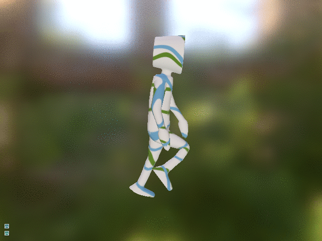

# GLTF Viewer

|||
|-----------------|-----------------|
|  |  |
|      |   |

This sample demonstrates how to use the [Asset Loader](https://github.com/DiligentGraphics/DiligentTools/tree/master/AssetLoader)
and [GLTF PBR Renderer](https://github.com/DiligentGraphics/DiligentFX/tree/master/GLTF_PBR_Renderer) to load and render GLTF models.

Additional models can be downloaded from [Khronos GLTF sample models repository](https://github.com/KhronosGroup/glTF-Sample-Models).
