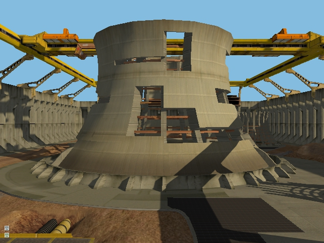

# Shadows Sample

This sample demonstrates how to integrate the [Shadowing component](https://github.com/DiligentGraphics/DiligentFX/tree/master/Components#shadows)
into an application to render high-quality shadows.

Sample controls:

* Left mouse button - rotate camera
* Right mouse button - rotate light
* W,S,A,D,Q,E - move camera
* Shift - accelerate
* Ctrl - super accelerate