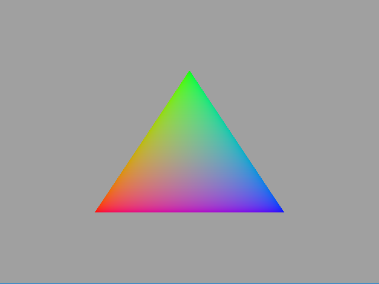

# Tutorial01 - Hello Triangle

This tutorial demonstrates the basics of Diligent Engine API. It shows how to create shaders, pipeline state object
and how to render a simple triangle.



## Shaders

This tutotial uses very basic shaders. The vertex shader generates a procedural triangle. It uses an array of hard-coded
vertex positions in screen space and assigns red, green and blue colors to the vertices. The shader uses system-generated
vertex id as an array index.

```hlsl
struct PSInput 
{ 
    float4 Pos   : SV_POSITION; 
    float3 Color : COLOR; 
};

void main(in  uint    VertId : SV_VertexID,
          out PSInput PSIn) 
{
    float4 Pos[3];
    Pos[0] = float4(-0.5, -0.5, 0.0, 1.0);
    Pos[1] = float4( 0.0, +0.5, 0.0, 1.0);
    Pos[2] = float4(+0.5, -0.5, 0.0, 1.0);

    float3 Col[3];
    Col[0] = float3(1.0, 0.0, 0.0); // red
    Col[1] = float3(0.0, 1.0, 0.0); // green
    Col[2] = float3(0.0, 0.0, 1.0); // blue

    PSIn.Pos   = Pos[VertId];
    PSIn.Color = Col[VertId];
}
```
The shader is written in HLSL. Diligent Engine uses shader source code converter to translate HLSL
into GLSL when needed. It can also use shaders authored in GLSL, but there is no GLSL to HLSL converter.

Pixel (fragment) shader simply interpolates vertex colors and is also written in HLSL:

```hlsl
struct PSInput 
{ 
    float4 Pos   : SV_POSITION; 
    float3 Color : COLOR; 
};

struct PSOutput
{ 
    float4 Color : SV_TARGET; 
};

void main(in  PSInput  PSIn,
          out PSOutput PSOut)
{
    PSOut.Color = float4(PSIn.Color.rgb, 1.0);
}
```

## Initializing the Pipeline State

Pipeline state is the object that encompasses the configuration of all GPU stages. To create a pipeline state,
populate `GraphicsPipelineStateCreateInfo` structure. The most important member of the structure that we will need to
initialize is `PSODesc`:

```cpp
GraphicsPipelineStateCreateInfo PSOCreateInfo;
```

Start by giving the PSO a name. It is always a good idea to give all objects descriptive names as
Diligent Engine uses these names in error reporting:

```cpp
PSOCreateInfo.PSODesc.Name = "Simple triangle PSO"; 
```

There are different types of pipeline states: graphics, compute, mesh, etc. This one is a graphics pipeline:

```cpp
PSOCreateInfo.PSODesc.PipelineType = PIPELINE_TYPE_GRAPHICS;
```

Next, we need to describe which outputs the pipeline state uses. This one has one output, the screen,
whose format can be queried through the swap chain object:

```cpp
PSOCreateInfo.GraphicsPipeline.NumRenderTargets = 1;
PSOCreateInfo.GraphicsPipeline.RTVFormats[0]    = pSwapChain->GetDesc().ColorBufferFormat;
PSOCreateInfo.GraphicsPipeline.DSVFormat        = pSwapChain->GetDesc().DepthBufferFormat;
```

Next, we need to define what kind of primitives the pipeline can render, which are triangles in our case:

```cpp
PSOCreateInfo.GraphicsPipeline.PrimitiveTopology = PRIMITIVE_TOPOLOGY_TRIANGLE_LIST;
```

In this example, we do not want to worry about culling back-facing triangles, so we disable it:

```cpp
PSOCreateInfo.GraphicsPipeline.RasterizerDesc.CullMode = CULL_MODE_NONE;
```

This pipeline state does not use depth testing:

```cpp
PSOCreateInfo.GraphicsPipeline.DepthStencilDesc.DepthEnable = False;
```

The pipeline state also allows configuring several other states (rasterizer state, blend state, input layout etc.),
but default values will work for now.

On the next step, we need to create shader objects. To create a shader, populate `ShaderCreateInfo` structure.

```cpp
ShaderCreateInfo ShaderCI;
```

The shaders are authored in HLSL, so we need to tell the system:

```cpp
ShaderCI.SourceLanguage = SHADER_SOURCE_LANGUAGE_HLSL;
```

When running in OpenGL mode, Diligent converts HLSL to GLSL. Since there are no separate
texture samplers in GLSL, Diligent uses emulated combined samplers 
(g_Texture + g_Texture_sampler pair). Event though this pixel shader does not use textures,
we still need to indicate we are using combined texture samplers, otherwise conversion will fail:

```cpp
ShaderCI.UseCombinedTextureSamplers = true;
```

In this example, vertex and pixel shaders are created from the source. The code is self-explanatory:

```cpp
// Create a vertex shader
RefCntAutoPtr<IShader> pVS;
{
    ShaderCI.Desc.ShaderType = SHADER_TYPE_VERTEX;
    ShaderCI.EntryPoint      = "main";
    ShaderCI.Desc.Name       = "Triangle vertex shader";
    ShaderCI.Source          = VSSource;
    pDevice->CreateShader(ShaderCI, &pVS);
}

// Create a pixel shader
RefCntAutoPtr<IShader> pPS;
{
    ShaderCI.Desc.ShaderType = SHADER_TYPE_PIXEL;
    ShaderCI.EntryPoint      = "main";
    ShaderCI.Desc.Name       = "Triangle pixel shader";
    ShaderCI.Source          = PSSource;
    pDevice->CreateShader(ShaderCI, &pPS);
}
```

Finally, we set the shaders in the `PSOCreateInfo` and create the graphics pipeline state:

```cpp
PSOCreateInfo.pVS = pVS;
PSOCreateInfo.pPS = pPS;
pDevice->CreateGraphicsPipelineState(PSOCreateInfo, &m_pPSO);
```

The pipeline state keeps references to the shader objects, so the app does not need to keep the references
unless it wants to use them.

## Rendering

All rendering commands in Diligent Engine go through device contexts that are very 
similar to D3D11 device contexts. There is immediate context that directly 
executes commands and deferred contexts. Deferred contexts are intended to record command 
lists that can later be executed by the immediate context.

Before rendering anything on the screen we want to clear it:

```cpp
const float ClearColor[] = {  0.350f,  0.350f,  0.350f, 1.0f }; 
auto* pRTV = m_pSwapChain->GetCurrentBackBufferRTV();
auto* pDSV = m_pSwapChain->GetDepthBufferDSV();
m_pImmediateContext->ClearRenderTarget(pRTV, ClearColor, RESOURCE_STATE_TRANSITION_MODE_TRANSITION);
m_pImmediateContext->ClearDepthStencil(pDSV, CLEAR_DEPTH_FLAG, 1.f, 0,
                                       RESOURCE_STATE_TRANSITION_MODE_TRANSITION);
```

Clearing the depth buffer is not really necessary, but we will keep it here for consistency.
Using `RESOURCE_STATE_TRANSITION_MODE_TRANSITION` flag tells the engine to perform required
state transitions.

Next, we need to set our pipeline state in the immediate device context:

```cpp
m_pImmediateContext->SetPipelineState(m_pPSO);
```

Typically after setting the pipeline state we should call `CommitShaderResources()`,
however shaders in this example don't use any resources.

Finally, we invoke the draw command that renders our 3 vertices:

```cpp
DrawAttribs drawAttrs;
drawAttrs.NumVertices = 3;
m_pImmediateContext->Draw(drawAttrs);
```

And that's it!
