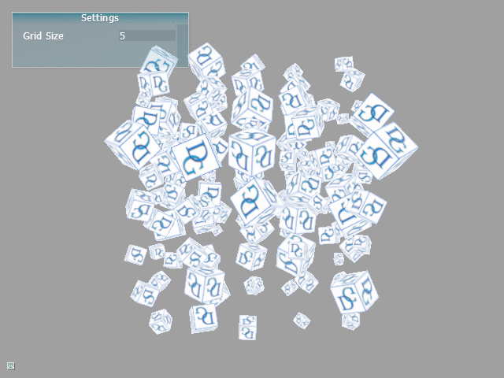

# Tutorial04 - Instancing

This tutorial extends Tutorial03 and demonstrates how to use instancing to render multiple copies
of one object using unique transformation matrix for every copy.



Instancing is a very widely used technique. It allows rendering multiple copies of one object (trees 
in a forest or characters in a crowd), using just single draw call. 

## Shaders

To allow instancing, vertex shader attibutes are split into two categories: per-vertex attributes
and per-instance attributes. Per-vertex attributes are regular vertex attributes, while per-instance
attributes are the same for all vertices in one object instance. In this example, we use
four attributes to encode rows of an instance-specific transform matrix:

```hlsl
cbuffer Constants
{
    float4x4 g_ViewProj;
    float4x4 g_Rotation;
};

struct VSInput
{
    // Vertex attributes
    float3 Pos      : ATTRIB0; 
    float2 UV       : ATTRIB1;

    // Instance attributes
    float4 MtrxRow0 : ATTRIB2;
    float4 MtrxRow1 : ATTRIB3;
    float4 MtrxRow2 : ATTRIB4;
    float4 MtrxRow3 : ATTRIB5;
};

struct PSInput 
{ 
    float4 Pos : SV_POSITION; 
    float2 UV  : TEX_COORD; 
};

void main(in  VSInput VSIn,
          out PSInput PSIn) 
{
    // HLSL matrices are row-major while GLSL matrices are column-major. We will
    // use convenience function MatrixFromRows() appropriately defined by the engine
    float4x4 InstanceMatr = MatrixFromRows(VSIn.MtrxRow0, VSIn.MtrxRow1, VSIn.MtrxRow2, VSIn.MtrxRow3);
    // Apply rotation
    float4 TransformedPos = mul(float4(VSIn.Pos,1.0), g_Rotation);
    // Apply instance-specific transformation
    TransformedPos = mul(TransformedPos, InstanceMatr);
    // Apply view-projection matrix
    PSIn.Pos = mul(TransformedPos, g_ViewProj);
    PSIn.UV  = VSIn.UV;
}

```

Pixel shader in this tutorial is identical to that of Tutorial03.

## Initializing the Pipeline State

The only difference in pipeline state initialization compared to Tutorial03 is how input layout is defined.
Besides vertex position and texture uv coordinates, we use four per-instance attributes:

```cpp
LayoutElement LayoutElems[] =
{
    // Per-vertex data - first buffer slot
    // Attribute 0 - vertex position
    LayoutElement{0, 0, 3, VT_FLOAT32, False},
    // Attribute 1 - texture coordinates
    LayoutElement{1, 0, 2, VT_FLOAT32, False},
            
    // Per-instance data - second buffer slot
    // We will use four attributes to encode instance-specific 4x4 transformation matrix
    // Attribute 2 - first row
    LayoutElement{2, 1, 4, VT_FLOAT32, False, INPUT_ELEMENT_FREQUENCY_PER_INSTANCE},
    // Attribute 3 - second row
    LayoutElement{3, 1, 4, VT_FLOAT32, False, INPUT_ELEMENT_FREQUENCY_PER_INSTANCE},
    // Attribute 4 - third row
    LayoutElement{4, 1, 4, VT_FLOAT32, False, INPUT_ELEMENT_FREQUENCY_PER_INSTANCE},
    // Attribute 5 - fourth row
    LayoutElement{5, 1, 4, VT_FLOAT32, False, INPUT_ELEMENT_FREQUENCY_PER_INSTANCE}
};
```

Note that the last four attributes come from the vertex stream #1 and that `FREQUENCY_PER_INSTANCE`
indicates that these are per-instance attributes. `LAYOUT_ELEMENT_AUTO_OFFSET` and `LAYOUT_ELEMENT_AUTO_STRIDE` are
special values that instruct the engine to automatically compute element offset and buffer stride assuming that
elements are tightly packed.

## Vertex and Index Buffers

Vertex and index buffers are the same as in Tutorial03, but we will also need another buffer
that will store per-instance transformation matrices:

```cpp
BufferDesc InstBuffDesc;
InstBuffDesc.Name          = "Instance data buffer";
InstBuffDesc.Usage         = USAGE_DEFAULT; 
InstBuffDesc.BindFlags     = BIND_VERTEX_BUFFER;
InstBuffDesc.uiSizeInBytes = sizeof(float4x4) * MaxInstances;
pDevice->CreateBuffer(InstBuffDesc, nullptr, &m_InstanceBuffer);
```

Note that this buffer will be updated at run-time, and the usage is `USAGE_DEFAULT`.

## Updating the Instance Buffer

`USAGE_DEFAULT` buffers should be updated using `UpdateData()` method as shown below:

```cpp
void Tutorial04_Instancing::PopulateInstanceBuffer()
{
    std::vector<float4x4> InstanceData(m_GridSize*m_GridSize*m_GridSize);

    // Compute transformation matrix for every instance

    Uint32 DataSize = static_cast<Uint32>(sizeof(InstanceData[0]) * InstanceData.size());
    m_InstanceBuffer->UpdateData(m_pImmediateContext, 0, DataSize, InstanceData.data());
}
```

## Rendering

In this example, we use two buffers containing per-vertex and per-instance data.
Both buffers need to be bound to the pipeline before calling rendering command:

```cpp
Uint32 offsets[] = {0, 0};
IBuffer* pBuffs[] = {m_CubeVertexBuffer, m_InstanceBuffer};
m_pImmediateContext->SetVertexBuffers(0, _countof(pBuffs), pBuffs, offsets,
                                      RESOURCE_STATE_TRANSITION_MODE_TRANSITION,
                                      SET_VERTEX_BUFFERS_FLAG_RESET);
m_pImmediateContext->SetIndexBuffer(m_CubeIndexBuffer, 0, RESOURCE_STATE_TRANSITION_MODE_TRANSITION);
```

Number of instances is specified by the `NumInstances` member of `DrawAttribs` structure:

```cpp
DrawIndexedAttribs DrawAttrs;
DrawAttrs.IndexType  = VT_UINT32; // Index type
DrawAttrs.NumIndices = 36;
// Number of instances
DrawAttrs.NumInstances = m_GridSize*m_GridSize*m_GridSize; 
m_pImmediateContext->DrawIndexed(DrawAttrs);
```
