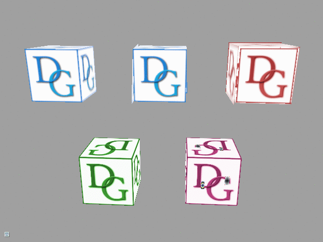

# Tutorial11 - Resource Updates

This tutorial demonstrates different ways to update buffers and textures in Diligent Engine and explains important
internal details and performance implications related to each method.



## Buffers

### Buffer Initialization

The most basic way to supply data into a buffer is to provide it at initialization time, for example:

```cpp
// Create index buffer
BufferDesc IndBuffDesc;
IndBuffDesc.Name          = "Cube index buffer";
IndBuffDesc.Usage         = USAGE_IMMUTABLE;
IndBuffDesc.BindFlags     = BIND_INDEX_BUFFER;
IndBuffDesc.uiSizeInBytes = sizeof(Indices);
BufferData IBData;
IBData.pData    = Indices;
IBData.DataSize = sizeof(Indices);
pDevice->CreateBuffer(IndBuffDesc, &IBData, &m_CubeIndexBuffer);
```

Note that the contents of `USAGE_IMMUTABLE` buffers cannot be changed and initial data must be given at initialization.
Initial data can also be provided for `USAGE_DEFAULT` buffers, but not for `USAGE_DYNAMIC` buffers that are updated through mapping.
Use `USAGE_IMMUTABLE` buffer for data that never changes (such as cube index buffer in this tutorial).

### Updating buffers with IBuffer::UpdateData()

The first way to update a buffer contents at run time is to use `IBuffer::UpdateData()` method. Only buffers created with
`USAGE_DEFAULT` flag can use this way. This method writes new data to a given buffer subregion, as in the example below:

```cpp
m_CubeVertexBuffer[BufferIndex]->UpdateData(
    m_pImmediateContext,                // Device context to use for the operation
    FirstVertToUpdate * sizeof(Vertex), // Start offset in bytes
    NumVertsToUpdate  * sizeof(Vertex), // Data size in bytes
    Vertices                            // Data pointer
);
```

Under the hood, Diligent Engine translates this call into the following operations:

#### OpenGL/GLES backend
The operation directly translates to [glBufferSubData](https://www.khronos.org/registry/OpenGL-Refpages/gl4/html/glBufferSubData.xhtml).

#### Direct3D11 backend
The operation directly translates to [ID3D11DeviceContext::UpdateSubresource](https://docs.microsoft.com/en-us/windows/desktop/api/d3d11/nf-d3d11-id3d11devicecontext-updatesubresource).

#### Direct3D12/Vulkan backend
Default buffers are allocated in GPU-only accessible memory, so the data cannot be written directly. 
To perform the operation, the engine first allocates a temporary storage in a CPU-visible memory, copies the data to this temporary 
storage and then issues GPU command to copy the data from the storage to the final destination. It also performs necessary resource
state transitions (such as shader resource -> copy destination).

#### Performance
`IBuffer::UpdateData()` is currently the only way to update data in a default (GPU-only) buffer. The operation involves two copy operations.
However the main and not so obvious performance issue with this method is state transitions. Every time when a buffer is used in
a copy operation, it needs to be transitioned to copy destination state. Every time it is used in a shader, it needs to be transitioned
to shader resource state. Transitioning back and forth stalls the GPU pipeline and degrades performance dramatically.

This method should be used when a buffer content stays constant most of the time and only needs to be updated occasionally,
usually no more often than once in a frame, for example, when reusing existing buffer to write new mesh data (vertices/indices).
This method should not be used for high frequency updates such as animation or constant buffer updates.

To illustrate this method, the tutorial updates positions of cube vertices every 0.1 seconds (see `Tutorial11_ResourceUpdates::UpdateBuffer()`).

#### Limitations
Inefficient for frequent updates.

### Updating Dynamic Buffers via Mapping

When buffer contents needs to be updated frequently (once or more times per frame), the buffer should be created with `USAGE_DYNAMIC` flag.
Dynamic buffers cannot be updated with `IBuffer::UpdateData()`. Instead, they need to be mapped to obtain a pointer that can be used
to write data directly to the buffer, as in the example below:

```cpp
Vertex* Vertices = nullptr;
VertexBuffer->Map(m_pImmediateContext, MAP_WRITE, MAP_FLAG_DISCARD, reinterpret_cast<PVoid&>(Vertices));
for(Uint32 v=0; v < _countof(CubeVerts); ++v)
{
    const auto& SrcVert = CubeVerts[v];
    Vertices[v].uv  = SrcVert.uv;
    Vertices[v].pos = SrcVert.pos * static_cast<float>(1 + 0.2*sin(m_CurrTime * (1.0 + v * 0.2)));
}
VertexBuffer->Unmap(m_pImmediateContext, MAP_WRITE, MAP_FLAG_DISCARD);
```

#### OpenGL/GLES backend
The operation translates to [glMapBufferRange](https://www.khronos.org/registry/OpenGL-Refpages/gl4/html/glMapBufferRange.xhtml) 
with `GL_MAP_WRITE_BIT` and `GL_MAP_INVALIDATE_BUFFER_BIT` flags set.

#### Direct3D11 backend
In Direct3D11 backend, this call directly translates to
[ID3D11DeviceContext::Map](https://docs.microsoft.com/en-us/windows/desktop/api/d3d11/nf-d3d11-id3d11devicecontext-map)
with `D3D11_MAP_WRITE_DISCARD` flag.

#### Direct3D12/Vulkan backend
When dynamic buffer is created in Direct3D12 or Vulkan backend, no memory is allocated. Instead, both backends have special dynamic
storage which is a buffer created in CPU-accessible memory that is persistently mapped. When dynamic buffer is mapped,
a region is reserved in this buffer. This operation boils down to simply moving current offset and is very cheap. A pointer
is then returned that references this memory and the application can write data directly, avoiding all copies. When a dynamic buffer is
used for rendering, internal dynamic buffer is bound instead and the proper offset is applied. Internal dynamic buffer is pre-transitioned
to read-only state and no transitions are ever performed at run time. The engine takes care of synchronization making sure that a region
in the buffer is never given to the application while being used by the GPU.

#### Performance
In Direct3D12/Vulkan backends mapping dynamic buffers with `MAP_FLAG_DISCARD` flag is very cheap as it only involves updating current
offset. It is hard to say what exactly Direct3D11 and OpenGL do under the hood, but most likely something similar. There is one significant
difference however: Direct3D11 and OpenGL preserve contents of dynamic buffers between frames while Direct3D12 and Vulkan backends do not.
As a result, mapping is many times more efficient in next-gen backends.

Dynamic buffers should be used for content that changes often, typically multiple times per frame. The most common example is a constant
buffer that is updated with different transformation matrices before every draw call. Dynamic buffers should not be used for constant
data that never changes.

To illustrate this method, the tutorial animates cube vertices by mapping the buffer in every frame
(see `Tutorial11_ResourceUpdates::MapDynamicBuffer()`).

#### Limitations

Only the entire buffer can currently be mapped with `MAP_FLAG_DISCARD` flag.

In Direct3D12 and Vulkan backends, the contents of all dynamic resources are lost at the end of every frame.
A dynamic buffer must be mapped in every frame before its first use.

The total amount of CPU-accessible memory can be limited. Besides, access from the GPU may be slower compared to 
GPU-only memory, so dynamic buffers should not be used to store resources that are constant or change infrequently.

## Textures
While buffers are simply linear regions of memory, textures are optimized for efficient sampling operations and 
use opaque layouts that are typically not exposed to the application. As a result, only the driver knows how
to write data to the texture. Linear layouts are allowed in Direct3D12 and Vulkan, but they are less efficient.

### Texture initialization

Similar to buffers, initial data can be supplied to textures at creation time. For `USAGE_IMMUTABLE` textures
this is the only way.

```cpp
TexDesc TexDesc;
TexDesc.Type      = RESOURCE_DIM_TEX_2D;
TexDesc.Format    = TEX_FORMAT_RGBA8_UNORM_SRGB;
TexDesc.Width     = 1024;
TexDesc.Height    = 1024;
TexDesc.MipLevels = 1;
TexDesc.BindFlags = BIND_SHADER_RESOURCE;
TexDesc.Usage     = USAGE_IMMUTABLE;

TextureData InitData;
 // Pointer to subresouce data, one for every mip level
InitData.pSubResources   = subresources;
InitData.NumSubresources = _countof(subresources);

RefCntAutoPtr<ITexture> Texture;
Device->CreateTexture(TexDesc, &InitData, &Texture);
```

### Updating textures with ITexture::UpdateData()

The first way to update textures is to use `ITexture::UpdateData()` method. The method works similar to 
`IBuffer::UpdateData()` and writes new data to a given texture region:

```cpp
Box UpdateBox;
Uint32 Width  = 128;
Uint32 Height = 64;
UpdateBox.MinX = 16;
UpdateBox.MinY = 32;
UpdateBox.MaxX = UpdateBox.MinX + Width;
UpdateBox.MaxY = UpdateBox.MinY + Height;

TextureSubResData SubresData;
SubresData.Stride = Width * 4;
SubresData.pData  = Data.data();
Uint32 MipLevel   = 0;
Uint32 ArraySlice = 0;
Texture->UpdateData(m_pImmediateContext, MipLevel, ArraySlice, UpdateBox, SubresData);
```

#### OpenGL/GLES backend
The operation directly translates to [glTexSubImage**](https://www.khronos.org/registry/OpenGL-Refpages/gl4/html/glTexSubImage2D.xhtml) 
family of functions.

#### Direct3D11 backend
As with buffer updates, in Direct3D11 backend, this call directly maps to
[ID3D11DeviceContext::UpdateSubresource](https://docs.microsoft.com/en-us/windows/desktop/api/d3d11/nf-d3d11-id3d11devicecontext-updatesubresource).

#### Direct3D12/Vulkan backend
As with buffers, to update a texture the next-gen backends first allocate region in a CPU-accessible memory and copy
client data to this region. They then perform necessary state transitions and issue GPU copy command that writes 
pixels to the texture using GPU-specific layout.

#### Performance
Usage scenarios are similar to buffer updates: the operation should be used for textures whose contents stay mostly 
constant and only occasionally requires updates.

This method is illustrated by `Tutorial11_ResourceUpdates::UpdateTexture()` function.

#### Limitations
As the operation involves two copies and state transitions, it is not efficient for frequent texture updates.

### Mapping textures

Mapping a texture is a second way to update its contents. From the API side, mapping textures looks similar to mapping buffers:

```cpp
Uint32 MipLevel   = 0;
Uint32 ArraySlice = 0;
MappedTextureSubresource MappedSubres;
Box MapRegion;
Uint32 Width  = 128;
Uint32 Height = 256;
MapRegion.MinX = 32;
MapRegion.MinY = 64;
MapRegion.MaxX = MapRegion.MinX + Width;
MapRegion.MaxY = MapRegion.MinY + Height;
Texture->Map(m_pImmediateContext, MipLevel, ArraySlice, MAP_WRITE, MAP_FLAG_DISCARD, &MapRegion, MappedSubres);
WriteTextureData( (Uint8*)MappedSubres.pData, Width, Height, MappedSubres.Stride);
Texture->Unmap(m_pImmediateContext, 0, 0);
```

What happens under the hood is very different compared to buffers.

#### OpenGL/GLES backend
Mapping textures is currently not supported in OpenGL/GLES backends.

#### Direct3D11 backend
In Direct3D11 backend, this call directly maps to
[ID3D11DeviceContext::Map](https://docs.microsoft.com/en-us/windows/desktop/api/d3d11/nf-d3d11-id3d11devicecontext-map)
with `D3D11_MAP_WRITE_DISCARD` flag.

#### Direct3D12/Vulkan backend
There are no dynamic textures in next-gen backends in a way similar to dynamic buffers. While buffers can easily be
suballocated from another buffer by binding parent buffer and applying an offset, there is no similar way for textures.
So even if the required memory was suballocated from the dynamic buffer, there would be no way to treat this memory
as a texture. Binding the memory to an existing texture is also not allowed.

As a result, mapping textures in Direct3D12/Vulkan backend does not differ significantly from updating textures with
`ITexture::UpdateData()`. When mapping a texture, the engine returns the pointer to the CPU-accessible memory directly
that avoids one copy. However, GPU-side copy and most importantly state transitions are still performed.

#### Performance

It is not exactly clear what Direct3D11 does under the hood. The two most likely options are either 
creating linear-layout texture and suballocating it from CPU-accessible memory every time `Map` is called,
or performing the same operations as Diligent's next-gen backends.

Mapping dynamic textures is not as efficient as mapping dynamic buffers, and typical usage scenarios
are similar to `ITexture::UpdateData()`.

There is no simple way to implement high-frequency texture updates across all APIs, so Diligent
expects that this will be implemented by the application using low-level API interoperability.

This method is illustrated by `Tutorial11_ResourceUpdates::UpdateTexture()` function.

#### Limitations
Texture mapping is not currently implemented in OpenGL/GLES backend.

In Direct3D11, only the entire texture level can be mapped with `D3D11_MAP_WRITE_DISCARD` flag.

In Direct3D12/Vulkan backends, mapping dynamic textures is not as efficient as mapping dynamic buffers.
In fact, it is very similar to updating textures with `ITexture::UpdateData()` and only avoids
one CPU-side copy.

# Summary

The following table summarizes update methods for buffers:

| Update scenario  | Usage           | Update Method         |   Comment           |
| -----------------|-----------------|-----------------------|---------------------|
| Constant data    |`USAGE_IMMUTABLE`|n/a                    | Data can only be written during buffer initialization|
| < Once per frame |`USAGE_DEFAULT`  |`IBuffer::UpdateData()`|                     |
| >= Once per frame|`USAGE_DYNAMIC`  |`IBuffer::Map()`       | The content of dynamic buffers is invalidated at the end of every frame |

The following table summarizes update methods for textures:

| Update scenario  | Usage/Update Method                |   Comment                   |
| -----------------| -----------------------------------|-----------------------------|
| Constant data    | `USAGE_IMMUTABLE` / n/a            | Data can only be written during texture initialization |
| < Once per frame | `USAGE_DEFAULT` + `ITexture::UpdateData()` or `USAGE_DYNAMIC` + `ITexture::Map()` |                |
| >= Once per frame|                                    | Dynamic textures cannot be implemented the same way as dynamic buffers |
