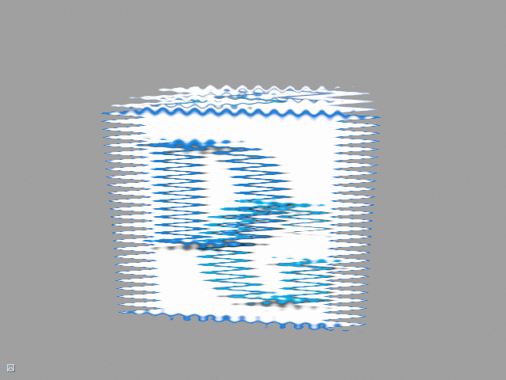

# Tutorial12 - Render Target

This tutorial demonstrates how to render a 3d textured cube into an offscreen render 
target and do a simple distortion post-processing effect. It is assumed
that you are familiar with all basics covered in Tutorial01 to Tutorial03.



## Cube Resources

Initialization of all cube-related resources and states is almost identical to how it is done
in Tutorial 03. The only difference is that this time the rendering of our cube will be done
into our offscreen render target, and we must ensure that the PSO uses corresponding formats:

```cpp
PSOCreateInfo.GraphicsPipeline.NumRenderTargets = 1;
PSOCreateInfo.GraphicsPipeline.RTVFormats[0]    = RenderTargetFormat;
PSOCreateInfo.GraphicsPipeline.DSVFormat        = DepthBufferFormat;
```

## Shaders

The render target's vertex shader generates the geometry procedurally using an array of hard-coded
vertex positions and UV coordinates.

```hlsl
struct VSInput
{
    uint VertexID : SV_VertexID;
};

struct PSInput
{
    float4 Pos : SV_POSITION;
    float2 UV  : TEX_COORD;
};

void main(in  VSInput VSIn,
          out PSInput PSIn)
{
    float4 Pos[4];
    Pos[0] = float4(-1.0, -1.0, 0.0, 1.0);
    Pos[1] = float4(-1.0, +1.0, 0.0, 1.0);
    Pos[2] = float4(+1.0, -1.0, 0.0, 1.0);
    Pos[3] = float4(+1.0, +1.0, 0.0, 1.0);

    float2 UV[4];
    UV[0] = float2(+0.0, +1.0);
    UV[1] = float2(+0.0, +0.0);
    UV[2] = float2(+1.0, +1.0);
    UV[3] = float2(+1.0, +0.0);

    PSIn.Pos = Pos[VSIn.VertexID];
    PSIn.UV  = UV[VSIn.VertexID];
}
```

Note that `float4 Pos[4] = {...};` construct does not translate well to GLSL.

Unlike other graphics API's, OpenGL has its texture coordinates origin at the bottom-left corner instead of the top left.
When sampling a regular texture, there is no visible difference since the texture data is also uploaded starting from
that lower-left corner. When sampling a framebuffer attachment, there is a visible difference, though. Hence we need
to flip the Y coordinate of the frame buffer attachment in OpenGL and OpenGL ES.

```hlsl
Texture2D    g_Texture;
SamplerState g_Texture_sampler;

struct PSInput
{
    float4 Pos   : SV_POSITION;
    float2 UV    : TEX_COORD;
};

struct PSOutput
{
    float4 Color : SV_TARGET;
};

void main(in  PSInput  PSIn,
          out PSOutput PSOut)
{
#if defined(DESKTOP_GL) || defined(GL_ES)
    float2 UV = float2(PSIn.UV.x, 1.0 - PSIn.UV.y);
#else
    float2 UV = PSIn.UV;
#endif

    float2 DistortedUV = UV + float2(sin(UV.y*30.0)*0.1  * sin(g_Time.x*3.0),
                                     sin(UV.x*20.0)*0.02 * sin(g_Time.x*2.0));
    PSOut.Color = g_Texture.Sample(g_Texture_sampler, DistortedUV);
}
```

## Initializing shaders and pipeline states

First we need to create the shaders that will handle our simple post-processing effect.

```cpp
ShaderCreateInfo CreationAttribs;
CreationAttribs.SourceLanguage             = SHADER_SOURCE_LANGUAGE_HLSL;
CreationAttribs.UseCombinedTextureSamplers = true;
BasicShaderSourceStreamFactory BasicSSSFactory;
CreationAttribs.pShaderSourceStreamFactory = pShaderSourceFactory;

RefCntAutoPtr<IShader> pRTVS;
{
    CreationAttribs.Desc.ShaderType = SHADER_TYPE_VERTEX;
    CreationAttribs.EntryPoint      = "main";
    CreationAttribs.Desc.Name       = "Render Target VS";
    CreationAttribs.FilePath        = "rendertarget.vsh";
    pDevice->CreateShader(CreationAttribs, &pRTVS);
}

RefCntAutoPtr<IShader> pRTPS;
{
    CreationAttribs.Desc.ShaderType = SHADER_TYPE_PIXEL;
    CreationAttribs.EntryPoint      = "main";
    CreationAttribs.Desc.Name       = "Render Target PS";
    CreationAttribs.FilePath        = "rendertarget.psh";
    pDevice->CreateShader(CreationAttribs, &pRTPS);
}
```

Then, we need to create another pipeline state object that will store all the information
required to render our small post-processing effect.

```cpp
GraphicsPipelineStateCreateInfo RTPSOCreateInfo;

PSOCreateInfo.PSODesc.Name = "Render Target PSO";
PSOCreateInfo.PSODesc.PipelineType                          = PIPELINE_TYPE_GRAPHICS;
PSOCreateInfo.GraphicsPipeline.NumRenderTargets             = 1;
PSOCreateInfo.GraphicsPipeline.RTVFormats[0]                = pSwapChain->GetDesc().ColorBufferFormat;
PSOCreateInfo.GraphicsPipeline.DSVFormat                    = pSwapChain->GetDesc().DepthBufferFormat;
PSOCreateInfo.GraphicsPipeline.PrimitiveTopology            = PRIMITIVE_TOPOLOGY_TRIANGLE_STRIP;
PSOCreateInfo.GraphicsPipeline.RasterizerDesc.CullMode      = CULL_MODE_BACK;
PSOCreateInfo.GraphicsPipeline.DepthStencilDesc.DepthEnable = False;
PSOCreateInfo.pVS = pRTVS;
PSOCreateInfo.pPS = pRTPS;

// Define variable type that will be used by default
PSOCreateInfo.PSODesc.ResourceLayout.DefaultVariableType = SHADER_RESOURCE_VARIABLE_TYPE_STATIC;

// Shader variables should typically be mutable, which means they are expected
// to change on a per-instance basis
ShaderResourceVariableDesc Vars[] =
{
    { SHADER_TYPE_PIXEL, "g_Texture", SHADER_RESOURCE_VARIABLE_TYPE_MUTABLE }
};
PSOCreateInfo.PSODesc.ResourceLayout.Variables    = Vars;
PSOCreateInfo.PSODesc.ResourceLayout.NumVariables = _countof(Vars);

// Define immutable sampler for g_Texture. Immutable samplers should be used whenever possible
ImmutableSamplerDesc ImtblSamplers[] =
{
    { SHADER_TYPE_PIXEL, "g_Texture", Sam_LinearClamp }
};
PSOCreateInfo.PSODesc.ResourceLayout.ImmutableSamplers    = ImtblSamplers;
PSOCreateInfo.PSODesc.ResourceLayout.NumImmutableSamplers = _countof(ImtblSamplers);

pDevice->CreateGraphicsPipelineState(RTPSOCreateInfo, &m_pRTPSO);
```

## Creating Offscreen Render Target

In this tutorial we will use our own off-screen depth buffer, so we can
save memory by not initializing the depth buffer in the swap chain:

```cpp
void Tutorial12_RenderTarget::GetEngineInitializationAttribs(RENDER_DEVICE_TYPE DeviceType,
                                                             EngineCreateInfo&  Attribs,
                                                             SwapChainDesc&     SCDesc)
{
    SampleBase::GetEngineInitializationAttribs(DeviceType, Attribs, SCDesc);
    // In this tutorial we will be using off-screen depth-stencil buffer, so
    // we do not need the one in the swap chain.
    SCDesc.DepthBufferFormat = TEX_FORMAT_UNKNOWN;
}
```

An offscreen render target is used to render the cube into and then sampled by the post-processing shader.
We want the size of our render targets to match the window size, so we override `WindowResize()` method and
create a new render target every time when the window resizes.

```cpp
RefCntAutoPtr<ITexture> pRTColor;
TextureDesc RTColorDesc;
RTColorDesc.Type        = RESOURCE_DIM_TEX_2D;
RTColorDesc.Width       = pSwapChain->GetDesc().Width;
RTColorDesc.Height      = pSwapChain->GetDesc().Height;
RTColorDesc.MipLevels   = 1;
RTColorDesc.Format      = RenderTargetFormat;
RTColorDesc.BindFlags   = BIND_SHADER_RESOURCE | BIND_RENDER_TARGET;
pDevice->CreateTexture(RTColorDesc, nullptr, &pRTColor);
m_pRTColorRTV = pRTColor->GetDefaultView(TEXTURE_VIEW_RENDER_TARGET);
```

We also need to create a depth buffer.

```cpp
RefCntAutoPtr<ITexture> pRTDepth;
TextureDesc RTDepthDesc = RTColorDesc;
RTDepthDesc.Format      = DepthBufferFormat;
RTDepthDesc.BindFlags   = BIND_SHADER_RESOURCE | BIND_DEPTH_STENCIL;
pDevice->CreateTexture(RTDepthDesc, nullptr, &pRTDepth);
m_pRTDepthDSV = pRTDepth->GetDefaultView(TEXTURE_VIEW_DEPTH_STENCIL);
```

Since we are using mutable variables, we need to create a new SRB and set new 
texture to `g_Texture` shader variable:

```cpp
m_pRTSRB.Release();
m_pRTPSO->CreateShaderResourceBinding(&m_pRTSRB, true);
m_pRTSRB->GetVariableByName(SHADER_TYPE_PIXEL, "g_Texture")->
            Set(pRTColor->GetDefaultView(TEXTURE_VIEW_SHADER_RESOURCE));
```

## Rendering

There are few changes that we need to make to our rendering procedure compared to the other tutorials.
At the beginning of the frame, we need to activate our offscreen render target and clear color and depth
buffers.

```cpp
const float ClearColor[] = { 0.350f,  0.350f,  0.350f, 1.0f };
m_pImmediateContext->SetRenderTargets(1, &m_pRTColorRTV, m_pRTDepthDSV,
                                      RESOURCE_STATE_TRANSITION_MODE_TRANSITION);
m_pImmediateContext->ClearRenderTarget(m_pRTColorRTV, ClearColor,
                                       RESOURCE_STATE_TRANSITION_MODE_TRANSITION);
m_pImmediateContext->ClearDepthStencil(m_pRTDepthDSV, CLEAR_DEPTH_FLAG, 1.0f, 0,
                                       RESOURCE_STATE_TRANSITION_MODE_TRANSITION);
```

The rendering of our cube looks similar to other tutorials.

After we're done rendering the cube, we need to deactivate our offscreen render target and draw a fullscreen quad
to the main framebuffer using our post-processing effect shader.

```cpp
const float Zero[] = { 0.0f,  0.0f,  0.0f, 1.0f };
auto* pRTV = m_pSwapChain->GetCurrentBackBufferRTV();
auto* pDSV = m_pSwapChain->GetDepthBufferDSV();
m_pImmediateContext->SetRenderTargets(1, &pRTV, pDSV,
                                      RESOURCE_STATE_TRANSITION_MODE_TRANSITION);
m_pImmediateContext->ClearRenderTarget(pRTV, Zero, RESOURCE_STATE_TRANSITION_MODE_TRANSITION);
m_pImmediateContext->ClearDepthStencil(pDSV, CLEAR_DEPTH_FLAG, 1.f, 0,
                                       RESOURCE_STATE_TRANSITION_MODE_TRANSITION);

m_pImmediateContext->SetPipelineState(m_pRTPSO);
m_pImmediateContext->CommitShaderResources(m_pRTSRB, RESOURCE_STATE_TRANSITION_MODE_TRANSITION);

DrawAttribs RTDrawAttrs;
RTDrawAttrs.NumVertices = 4;
RTDrawAttrs.Flags       = DRAW_FLAG_VERIFY_ALL; // Verify all states
m_pImmediateContext->Draw(RTDrawAttrs);
```
