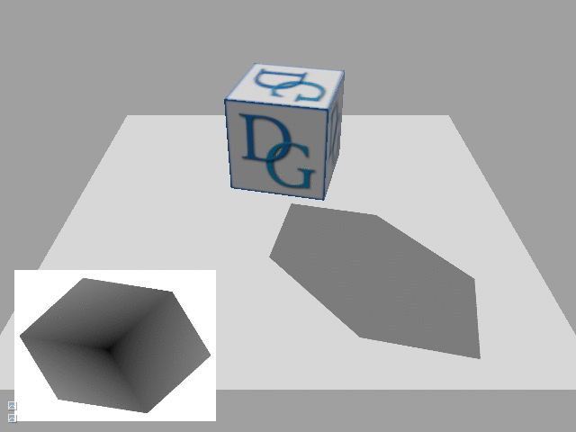

# Tutorial13 - Shadow Map

This tutorial demonstrates how to render basic shadows using a shadow map.
It is assumed that you are familiar with all basics covered in Tutorial01 to 
Tutorial03 as well as in Tutorial12. Please note that this tutorial only demonstrates
basic setup and does not cover shadow map filtering, artifacts removal and other topics.
Refer to [Shadows sample](https://github.com/DiligentGraphics/DiligentSamples/tree/master/Samples/Shadows)
for a real-world shadow map implementation.



Rendering shadows with a shadow map consists of two steps:

* The scene is rendered from the point of view of the light into a dedicated depth
  buffer called shadow map.
* The scene is rendered from the main camera, and the shadow map is used to determine
  if the point is lit or not by comparing the point's depth in light space to the
  depth stored in the shadow map.

This tutorial renders a cube into the shadow map and then uses it to cast a shadow onto a plane.

## Creating a shadow map texture

A shadow map is just a normal 2D texture that can be used as depth-stencil buffer
and shader resource:

```cpp
TextureDesc SMDesc;
SMDesc.Name      = "Shadow map";
SMDesc.Type      = RESOURCE_DIM_TEX_2D;
SMDesc.Width     = m_ShadowMapSize;
SMDesc.Height    = m_ShadowMapSize;
SMDesc.Format    = m_ShadowMapFormat;
SMDesc.BindFlags = BIND_SHADER_RESOURCE | BIND_DEPTH_STENCIL;
RefCntAutoPtr<ITexture> ShadowMap;
m_pDevice->CreateTexture(SMDesc, nullptr, &ShadowMap);
m_ShadowMapSRV = ShadowMap->GetDefaultView(TEXTURE_VIEW_SHADER_RESOURCE);
m_ShadowMapDSV = ShadowMap->GetDefaultView(TEXTURE_VIEW_DEPTH_STENCIL);
```

## Shadow pass pipeline state

There are few specifics of the shadow pass PSO initialization. First, there are no render targets:

```cpp
PSOCreateInfo.PSODesc.Name                      = "Cube shadow PSO";
// Shadow pass doesn't use any render target outputs
PSOCreateInfo.GraphicsPipeline.NumRenderTargets = 0;
PSOCreateInfo.GraphicsPipeline.RTVFormats[0]    = TEX_FORMAT_UNKNOWN;
// The DSV format is the shadow map format
PSOCreateInfo.GraphicsPipeline.DSVFormat        = m_ShadowMapFormat;
```

Since we don't use render targets, we also don't need a pixel shader:

```cpp
PSOCreateInfo.GraphicsPipeline.pVS              = pShadowVS;
// We don't use pixel shader as we are only interested in populating the depth buffer
PSOCreateInfo.GraphicsPipeline.pPS              = nullptr;
```

Finally, we typically want to disable depth clipping. This is to make sure that
objects that are closer than the near clipping plane are still rendered into the
shadow map.

```cpp
PSOCreateInfo.GraphicsPipeline.RasterizerDesc.DepthClipEnable = False;
```

## Rendering the shadow map

First, we need to bind the shadow map to the context (note that no render targets are provided) and clear it:

```cpp
m_pImmediateContext->SetRenderTargets(0, nullptr, m_ShadowMapDSV,
                                      RESOURCE_STATE_TRANSITION_MODE_TRANSITION);
m_pImmediateContext->ClearDepthStencil(m_ShadowMapDSV, CLEAR_DEPTH_FLAG, 1.f, 0,
                                       RESOURCE_STATE_TRANSITION_MODE_TRANSITION);
RenderShadowMap();
```

`RenderShadowMap` function first constructs shadow map matrices and then renders the cube into the shadow map
using shadow-only mode.

The function starts by building a world-to-light-view-space transformation matrix. The Z axis of this
matrix is the light direction. Two other axes are selected to avoid precision issues:

```cpp
float3 f3LightSpaceX, f3LightSpaceY, f3LightSpaceZ;
f3LightSpaceZ = normalize(m_LightDirection);
    
auto min_cmp = std::min(std::min(std::abs(m_LightDirection.x), std::abs(m_LightDirection.y)),
                        std::abs(m_LightDirection.z));
if (min_cmp == std::abs(m_LightDirection.x))
    f3LightSpaceX =  float3(1, 0, 0);
else if (min_cmp == std::abs(m_LightDirection.y))
    f3LightSpaceX =  float3(0, 1, 0);
else
    f3LightSpaceX =  float3(0, 0, 1);
    
f3LightSpaceY = cross(f3LightSpaceZ, f3LightSpaceX);
f3LightSpaceX = cross(f3LightSpaceY, f3LightSpaceZ);
f3LightSpaceX = normalize(f3LightSpaceX);
f3LightSpaceY = normalize(f3LightSpaceY);
    
float4x4 WorldToLightViewSpaceMatr = float4x4::ViewFromBasis(f3LightSpaceX, f3LightSpaceY, f3LightSpaceZ);
```

Second, we need to define the scene boundaries. For this tutorial we know that the cube center 
is at (0,0,0). Real applications will want to compute tight bounds as this is crucial for 
getting high-quality shadows.

```cpp
float3 f3SceneCenter = float3(0, 0, 0);
float SceneRadius = std::sqrt(3.f);
float3 f3MinXYZ = f3SceneCenter - float3(SceneRadius, SceneRadius, SceneRadius);
float3 f3MaxXYZ = f3SceneCenter + float3(SceneRadius, SceneRadius, SceneRadius*5);
float3 f3SceneExtent = f3MaxXYZ - f3MinXYZ;
```

Next, we need to compute the scaling and biasing matrices such that scene extent
is transformed to a normalized device space. Note that while in Direct3D11, Direct3D12, and
Vulkan this space is [-1,1]x[-1,1]x[0,1], in OpenGL it is [-1,1]x[-1,1]x[-1,1].

```cpp
const auto& DevCaps = m_pDevice->GetDeviceCaps();
const bool IsGL = DevCaps.IsGLDevice();
float4 f4LightSpaceScale;
f4LightSpaceScale.x =  2.f / f3SceneExtent.x;
f4LightSpaceScale.y =  2.f / f3SceneExtent.y;
f4LightSpaceScale.z =  (IsGL ? 2.f : 1.f) / f3SceneExtent.z;
// Apply bias to shift the extent to [-1,1]x[-1,1]x[0,1] for DX or to [-1,1]x[-1,1]x[-1,1] for GL
// Find bias such that f3MinXYZ -> (-1,-1,0) for DX or (-1,-1,-1) for GL
float4 f4LightSpaceScaledBias;
f4LightSpaceScaledBias.x = -f3MinXYZ.x * f4LightSpaceScale.x - 1.f;
f4LightSpaceScaledBias.y = -f3MinXYZ.y * f4LightSpaceScale.y - 1.f;
f4LightSpaceScaledBias.z = -f3MinXYZ.z * f4LightSpaceScale.z + (IsGL ? -1.f : 0.f);
 
float4x4 ScaleMatrix = float4x4::Scale(f4LightSpaceScale.x, f4LightSpaceScale.y, f4LightSpaceScale.z);
float4x4 ScaledBiasMatrix = float4x4::Translation(f4LightSpaceScaledBias.x, f4LightSpaceScaledBias.y,
                                                  f4LightSpaceScaledBias.z);
```

Now we can compute the light projection and the world-to-light-proj-space matrices:

```cpp
float4x4 ShadowProjMatr = ScaleMatrix * ScaledBiasMatrix;
float4x4 WorldToLightProjSpaceMatr = WorldToLightViewSpaceMatr * ShadowProjMatr;
```

The last step is to compute the world-to-shadow-map matrix that will be used in the shader
to sample the shadow map. Note again that OpenGL is unlike other APIs, so we use `NDCAttribs`
struct to handle the differences.

```cpp
const auto& NDCAttribs = DevCaps.GetNDCAttribs();
float4x4 ProjToUVScale = float4x4::Scale(0.5f, NDCAttribs.YtoVScale, NDCAttribs.ZtoDepthScale);
float4x4 ProjToUVBias  = float4x4::Translation(0.5f, 0.5f, NDCAttribs.GetZtoDepthBias());
m_WorldToShadowMapUVDepthMatr = WorldToLightProjSpaceMatr * ProjToUVScale * ProjToUVBias;
```

Finally we can render the cube into the shadow map using `WorldToLightProjSpaceMatr`:

```cpp
RenderCube(WorldToLightProjSpaceMatr, true);
```

## Using the Shadow Map in the shader

Shadow map is bound to the SRB object like any other texture:

```cpp
m_PlaneSRB->GetVariableByName(SHADER_TYPE_PIXEL, "g_ShadowMap")->Set(m_ShadowMapSRV);
```

The vertex shader is pretty standard except for computing the shadow map position
with `g_WorldToShadowMapUVDepth` matrix:

```hlsl
float4 ShadowMapPos = mul(Pos[VertId], g_WorldToShadowMapUVDepth);
PSIn.ShadowMapPos = ShadowMapPos.xyz / ShadowMapPos.w;
```

The fragment shader uses the shadow map position to sample the shadow map. Note that
it uses `SampleCmp` method that performs 2x2 comparison filering of the shadow map
to get smoother edges:

```hlsl
Texture2D              g_ShadowMap;
SamplerComparisonState g_ShadowMap_sampler;

struct PlanePSOutput
{
    float4 Color : SV_TARGET;
};

void main(in  PlanePSInput  PSIn,
          out PlanePSOutput PSOut)
{
    float LightAmount = g_ShadowMap.SampleCmp(g_ShadowMap_sampler, PSIn.ShadowMapPos.xy,
                                              max(PSIn.ShadowMapPos.z, 1e-7));
    PSOut.Color.rgb = float3(1.0, 1.0, 1.0) * (PSIn.NdotL * LightAmount * 0.8 + 0.2);
    PSOut.Color.a   = 1.0;
}
```
