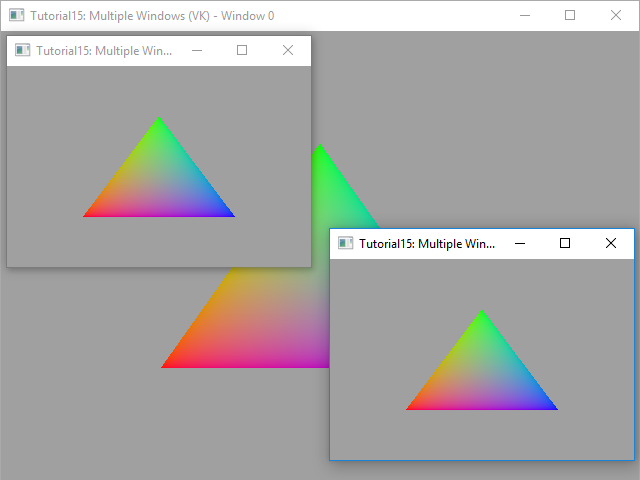

# Tutorial15 - Multiple Windows

This tutorial demonstrates how to use Diligent Engine to render to multiple windows.



This tutorial is based on Tutorial00_HelloWin32 and in fact is only slightly more complicated.
Essentially, instead of one window it creates three windows, and for every window it creates a swap chain using
the window's handle. An important detail here is that one of the swap chains can be labeled as primary by setting
corresponding member of the `SwapChainDesc` struct. It is the back buffer and depth-stencil buffer of the primary swap that
are set by `SetRenderTargets(0, nullptr, nullptr)` call. Notice that there must only be one primary swap chain.
Also, when `Present()` is called for the primary swap chain, the engine increments the frame counter and releases stale
resources.

To bind render target and depth-stencil buffers of the secondary swap chain, use `ISwapChain::GetCurrentBackBufferRTV()` and
`ISwapChain::GetDepthBufferDSV()` methods:

```cpp
ITextureView* pRTV = pSwapChain->GetCurrentBackBufferRTV();
ITextureView* pDSV = pSwapChain->GetDepthBufferDSV();
m_pImmediateContext->SetRenderTargets(1, &pRTV, pDSV, RESOURCE_STATE_TRANSITION_MODE_TRANSITION);
```

When the application is done with rendering commands, it should call `Present()` for every swap chain.