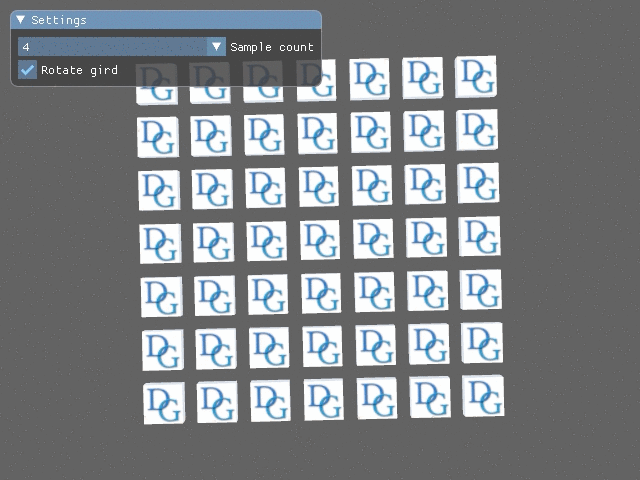

# Tutorial17 - MSAA

This tutorial demonstrates how to use multisample anti-aliasing (MSAA) to make geometrical edges look smoother
and more temporarily stable.



[MSAA](https://en.wikipedia.org/wiki/Multisample_anti-aliasing) is an industry-standard method of alleviating
geometrical aliasing and is supported by all modern graphics hardware. This tutorial shows how to use MSAA
in Diligent Engine.

## Creating Multi-Sampled Render Target and Depth Buffer

Creating a multi-sampled render target and a depth buffer is not more involved than
creating regular off-screen render targets (see
[Tutorial 12](https://github.com/DiligentGraphics/DiligentSamples/tree/master/Tutorials/Tutorial12_RenderTarget)).
In fact, the only difference is that we set `SampleCount` member of the `TextureDesc` struct to the
desired number of samples:

```cpp
TextureDesc ColorDesc;
ColorDesc.Name        = "Multisampled render target";
ColorDesc.Type        = RESOURCE_DIM_TEX_2D;
ColorDesc.BindFlags   = BIND_RENDER_TARGET;
ColorDesc.Width       = m_pSwapChain->GetDesc().Width;
ColorDesc.Height      = m_pSwapChain->GetDesc().Height;
ColorDesc.MipLevels   = 1;
ColorDesc.Format      = m_pSwapChain->GetDesc().ColorBufferFormat;
// Specify the desired number of samples
ColorDesc.SampleCount = m_SampleCount;

RefCntAutoPtr<ITexture> pColor;
m_pDevice->CreateTexture(ColorDesc, nullptr, &pColor);
// Store the render target view
m_pMSColorRTV = pColor->GetDefaultView(TEXTURE_VIEW_RENDER_TARGET);
```

Multisampled depth buffer is created in much the same way:
```cpp
TextureDesc DepthDesc = ColorDesc;
DepthDesc.Name        = "Multisampled depth buffer";
DepthDesc.Format      = DepthBufferFormat;
DepthDesc.BindFlags   = BIND_DEPTH_STENCIL;

RefCntAutoPtr<ITexture> pDepth;
m_pDevice->CreateTexture(DepthDesc, nullptr, &pDepth);
// Store the depth-stencil view
m_pMSDepthDSV = pDepth->GetDefaultView(TEXTURE_VIEW_DEPTH_STENCIL);
```

## Pipeline State Initialization

When creating a PSO object, we need to specify the number of samples as well:

```cpp
PSOCreateInfo.PSODesc.GraphicsPipeline.SmplDesc.Count = m_SampleCount;
```

Other than that, there is nothing new compared to previous tutorials.

## Resolving Multisampled Resource

Multi-sampled resources cannot be used directly in many rendering operations and need to be converted
to a single-sample representation first. This operation is called *resolving*.
Diligent Engine exposes `IDeviceContext::ResolveTextureSubresource` method that performs
resolve operation. In our example, we will resolve our multi-sampled color buffer directly
to the current swap chain image:

```cpp
auto pCurrentBackBuffer = m_pSwapChain->GetCurrentBackBufferRTV()->GetTexture();
ResolveTextureSubresourceAttribs ResolveAttribs;
ResolveAttribs.SrcTextureTransitionMode = RESOURCE_STATE_TRANSITION_MODE_TRANSITION;
ResolveAttribs.DstTextureTransitionMode = RESOURCE_STATE_TRANSITION_MODE_TRANSITION;
m_pImmediateContext->ResolveTextureSubresource(m_pMSColorRTV->GetTexture(), pCurrentBackBuffer, ResolveAttribs);
```

## Checking MSAA Support

Multisampling support may depends on format, GPU and other fators. To query sample counts
supported by a format, use `IRenderDevice::GetTextureFormatInfoExt` method. The `SampleCounts`
member of the returned structure has 1 bit set for all supported sample counts:

```cpp
const auto& ColorFmtInfo = pDevice->GetTextureFormatInfoExt(m_pSwapChain->GetDesc().ColorBufferFormat);
const auto& DepthFmtInfo = pDevice->GetTextureFormatInfoExt(DepthBufferFormat);
m_SupportedSampleCounts = ColorFmtInfo.SampleCounts & DepthFmtInfo.SampleCounts;
if (m_SupportedSampleCounts & 0x04)
    m_SampleCount = 4;
else if (m_SupportedSampleCounts & 0x02)
    m_SampleCount = 2;
else
{
    LOG_WARNING_MESSAGE(ColorFmtInfo.Name, " + ", DepthFmtInfo.Name,
                        " pair does not allow multisampling on this device");
    m_SampleCount = 1;
}
```
