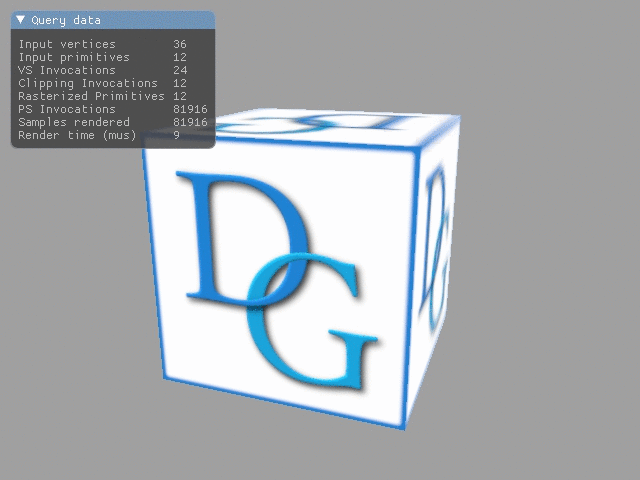

# Tutorial18 - Queries

This tutorial demonstrates how to use queries to retrieve various information about
the GPU operation, such as the number of primitives rendered, command processing duration, etc.



## Queries

Queries operate by enclosing a sequence of commands in interest in `BeginQuery()`/`EndQuery()` block.
Queries are intrinsically asynchronous, which means that the query result can't be accessed immediately,
but rather becomes available later after the commands are executed by the GPU. The queries provide tools
to check the data availability and retrieve it, see the desription of
[IQuery](https://github.com/DiligentGraphics/DiligentCore/blob/master/Graphics/GraphicsEngine/interface/Query.h)
interface for details.

## Checking Query Support

Not all devices support all types of queries. The support of a specific query type is indicated
by the corresponding memeber of `DeviceFeatures` struct that can be obtained using `IRenderDevice::GetDeviceCaps` method.

## Query Helpers

Applications may choose to use the `IQuery` interface directly. The engine also provides two helper classes to
facilitate the query usage: `ScopedQueryHelper` should be used for pipeline statistics, occlusion and binary occlusion queries.
`DurationQueryHelper` is designed to measure the duration of a sequence of GPU commands. The class usage is straightforward as the
following code example shows:

```cpp
std::unique_ptr<ScopedQueryHelper>   m_pPipelineStatsQuery;
std::unique_ptr<ScopedQueryHelper>   m_pOcclusionQuery;
std::unique_ptr<DurationQueryHelper> m_pDurationQuery;

// ...

m_pPipelineStatsQuery->Begin(m_pImmediateContext);
m_pOcclusionQuery->Begin(m_pImmediateContext);
m_pDurationQuery->Begin(m_pImmediateContext);

m_pImmediateContext->DrawIndexed(DrawAttrs);

m_pDurationQuery->End(m_pImmediateContext, m_RenderDuration);
m_pOcclusionQuery->End(m_pImmediateContext, &m_OcclusionData, sizeof(m_OcclusionData));
m_pPipelineStatsQuery->End(m_pImmediateContext, &m_PipelineStatsData, sizeof(m_PipelineStatsData));
```
