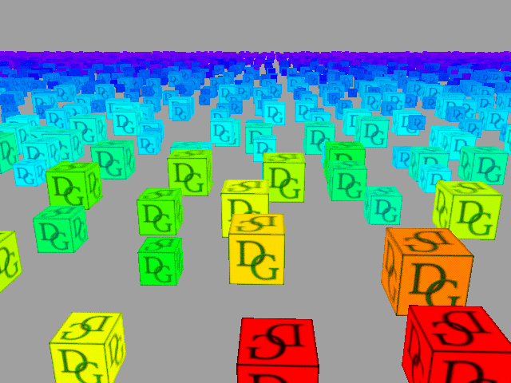

# Tutorial20 - Mesh shader

This tutorial demonstrates how to use amplification and mesh shaders, the new programmable stages, to implement
view frustum culling and object LOD calculation on the GPU.



Mesh shader pipeline is designed to replace the traditional primitive generation pipeline that consists of vertex attribute fetch stage, vertex shader,
tessellation and geometry shader, with a new fully programmable pipeline that is much more efficient and flexibile. The new pipeline consists
of two new programmable stages - the mesh shader itself, which in its simplest form implements the functionality of the vertex shader,
but is much more powerful, and an optional amplification (or task) shader stage. The amplification shader adds an extra indirection level.
It can generate up to 65k mesh shader invocations and can be used for culling, level-of-details (LOD) selection, etc.

Mesh shaders are supported in DirectX 12.2 and are an extension in Vulkan.

In this tutorial, we will use amplification shader stage to perform view-frustum culling and LOD selection. The mesh shader will be responsible
for computing vertex positions and generating primitives. Note that for the sake of simplicity in this tutorial we do not change
the geometry based on the LOD, but only output it as a color.

## Amplification shader

As we discussed above, amplification shader is the first new programmable stage and will be doing frustum culling and LOD selection.
The shader looks like a compute shader and executes 32 threads per group:

```hlsl
#define GROUP_SIZE 32

[numthreads(GROUP_SIZE,1,1)]
void main(in uint I  : SV_GroupIndex,
          in uint wg : SV_GroupID)
{
```

Because mesh and amplification shaders don't have any built-in input attributes except for thread ID and group ID, we use structured
buffer to pass draw commands down to them. A real application will likely use at least transformation, mesh ID and material ID for each object.
In this tutorial for simplicity we will only provide the cube position in a 2D grid (`BasePos`), its scale (`Scale`), and time offset (`TimeOffset`)
that is used by the shader for animation:

```hlsl
struct DrawTask
{
    float2 BasePos;
    float  Scale;
    float  TimeOffset;
};
StructuredBuffer<DrawTask> DrawTasks;
```

The shader will need to use some global data: a view matrix and cotangent of the half FOV of the camera to calculate the cube detail level (LOD);
six frustum planes for frustum culling; elapsed time to animate cube positions. This information is stored in a regular constant buffer:

```hlsl
struct Constants
{
    float4x4 ViewMat;
    float4x4 ViewProjMat;
    float4   Frustum[6];
    float    CoTanHalfFov;
    float    ElapsedTime;
    uint     FrustumCulling;
    uint     Padding;
};
cbuffer cbConstants
{
    Constants g_Constants;
}
```

Another piece of information that the amplification shader will use is the cube geometry, which is provided through another constant buffer.
The shader only needs the radius of the circumscribed sphere, which it will use for frustum culling:

```hlsl
struct CubeData
{
    float4 SphereRadius;
    ...
};
cbuffer cbCubeData
{
    CubeData g_CubeData;
}
```

An RW-buffer `Statistics` is used to count the number of visible cubes after the frustum culling. The value is not used in the shaders,
but is read back on the CPU to show the counter in the UI:

```hlsl
RWByteAddressBuffer Statistics;
```

The data that the amplification shader invocations will be working on (vertex positions, scale, LOD) 
is stored in a shared memory. Each thread in the group will work on its own element:

```hlsl
struct Payload
{
    float PosX[GROUP_SIZE];
    float PosY[GROUP_SIZE];
    float PosZ[GROUP_SIZE];
    float Scale[GROUP_SIZE];
    float LODs[GROUP_SIZE];
};
groupshared Payload s_Payload;
```

To get a unique index in each thread, we will use the `s_TaskCount` shared variable.
At the start of the shader we reset the counter to zero. We only write the value from the first thread
in the group to avoid data races and then issue a barrier to make the value visible to other threads
and make sure that all threads are at the same step.

```hlsl
groupshared uint s_TaskCount;

[numthreads(GROUP_SIZE,1,1)]
void main(in uint I : SV_GroupIndex,
          in uint wg : SV_GroupID)
{
    // Reset the counter from the first thread in the group
    if (I == 0)
    {
        s_TaskCount = 0;
    }

    // Flush the cache and synchronize
    GroupMemoryBarrierWithGroupSync();
    ...
```

The shader reads the thread-specific values and computes
the position of the object using its draw task arguments.
The `gid` is the global index of the draw task data.

```hlsl
    const uint gid   = wg * GROUP_SIZE + I;
    DrawTask   task  = DrawTasks[gid];
    float3     pos   = float3(task.BasePos, 0.0).xzy;
    float      scale = task.Scale;
    float      timeOffset  = task.TimeOffset;

    // Simple animation
    pos.y = sin(g_Constants.CurrTime + timeOffset);
```

It then performs frustum culling using the object position and if the object is visible, 
atomically increments the shared `s_TaskCount` value and computes the LOD.
The `index` variable returned by `InterlockedAdd` stores the index to access the arrays in the payload. The index is
guaranteed to be unique for all threads, so that they will all be working on different array elements:

```hlsl
    if (g_Constants.FrustumCulling == 0 || IsVisible(pos, g_CubeData.SphereRadius.x * scale))
    {
        uint index = 0;
        InterlockedAdd(s_TaskCount, 1, index);
        
        s_Payload.PosX[index]  = pos.x;
        s_Payload.PosY[index]  = pos.y;
        s_Payload.PosZ[index]  = pos.z;
        s_Payload.Scale[index] = scale;
        s_Payload.LODs[index]  = CalcDetailLevel(pos, g_CubeData.SphereRadius.x * scale);
    }
```

`IsVisible()` function calculates the signed distance from each frustum plane to the sphere and computes
its visibility by comparing the distances to the sphere radius.

The LOD calculation (`CalcDetailLevel` function) is based on computing the object bounding sphere radius in screen space.
For detailed description of the algorithm, see the link in [Further Reading](#further-reading).

After the payload has been written, we need to issue another barrier to wait until all threads reach the same point.
After that we can safely read the `s_TaskCount` value.
The first thread in the group atomically adds this value to the global `Statistics` counter. Note that this is much faster than incrementing
the counter from each thread because it minimizes the access to global memory.

The final step of the amplification shader is calling the `DispatchMesh()` function with the number of groups and the payload
that will spawn an s_TaskCount mesh shader invocations. For compatibility with Vulkan API you should only use the X group count.
The `DispatchMesh()` function must be called exactly once per amplification shader.
The `DispatchMesh()` call implies a `GroupMemoryBarrierWithGroupSync()`, and ends the amplification shader group's execution.

```hlsl
    GroupMemoryBarrierWithGroupSync();

    if (I == 0)
    {
        // Update statistics from the first thread
        uint orig_value;
        Statistics.InterlockedAdd(0, s_TaskCount, orig_value);
    }
    
    DispatchMesh(s_TaskCount, 1, 1, s_Payload);
```

## Mesh shader

Recall that the purpose of the mesh shader in this tutorial is to compute the vertex positions, very much
like vertex shader in a traditional pipeline, and also to output primitives. Unlike vertex shader though, 
mesh shader invocations run in compute groups very much like compute shaders and can share the data between threads.

We will use 24 threads out of the 32 maximum threads available.
We will produce 24 vertices and 12 primitives with 36 indices.
`SV_GroupIndex` indicates the mesh shader invocation index (0 to 23 in our case).
`SV_GroupID` indicates the amplification shader output (0 to `s_TaskCount-1`).

```hlsl
[numthreads(24,1,1)]
[outputtopology("triangle")]
void main(in uint I   : SV_GroupIndex,
          in uint gid : SV_GroupID,
          in  payload  Payload  payload,
          out indices  uint3    tris[12],
          out vertices PSInput  verts[24])
{
    // Only the input values from the the first active thread are used.
    SetMeshOutputCounts(24, 12);
```

We read the amplification shader output using the group id (`gid`):

```hlsl
float3 pos;
float  scale = payload.Scale[gid];
float  LOD   = payload.LODs[gid];
pos.x = payload.PosX[gid];
pos.y = payload.PosY[gid];
pos.z = payload.PosZ[gid];
```

The mesh shader uses the same cube constant buffer as the amplification shader, 
but it also uses the cube vertex attributes and indices.
Each mesh shader thread works on only one output vertex identified by the group index `I`.
Much like regular vertex shader, it transforms the vertex using the view-projection matrix:

```hlsl
verts[I].Pos = mul(float4(pos + g_CubeData.Positions[I].xyz * scale, 1.0), g_CubeData.ViewProjMat);
verts[I].UV  = g_CubeData.UVs[I].xy;
```

As we mentioned earlier, LOD doesn't affect the vertex count, and we simply display it as color:

```hlsl
float4 Rainbow(float factor)
{
    float  h   = factor / 1.35;
    float3 col = float3(abs(h * 6.0 - 3.0) - 1.0, 2.0 - abs(h * 6.0 - 2.0), 2.0 - abs(h * 6.0 - 4.0));
    return float4(clamp(col, float3(0.0, 0.0, 0.0), float3(1.0, 1.0, 1.0)), 1.0);
}
...

verts[I].Color = Rainbow(LOD);
```

Finally, we output primitives (the 6 cube faces consisting of 12 triangles total).
Only the first 12 threads write the indices.
Note that we must not access the array outside of its bounds.

```hlsl
if (I < 12)
{
    tris[I] = g_CubeData.Indices[I].xyz;
}
```


## Preparing the cube data

In this tutorial the cube data is arranged differently compared to the previous ones - we don’t have separate vertex and index buffers,
the mesh shader reads the data from the buffer directly.
We keep all data in a constant buffer because we only have one small mesh. However, a real application
should use a structured or an unordered access buffer.
All elements in the array in the constant buffer must be 16-byte aligned.

```cpp
struct CubeData
{
    float4 sphereRadius;
    float4 pos[24];
    float4 uv[24];
    uint4  indices[36 / 3];
};

const float4 CubePos[] =
{
    float4(-1,-1,-1,0), float4(-1,+1,-1,0), float4(+1,+1,-1,0), float4(+1,-1,-1,0),
    ...
};

const float4 CubeUV[] = 
{
    float4(0,1,0,0), float4(0,0,0,0), float4(1,0,0,0), float4(1,1,0,0),
    ...
};

const uint4 Indices[] =
{
    uint4{2,0,1,0},    uint4{2,3,0,0},
    ...
};

CubeData Data;
Data.sphereRadius = float4{length(CubePos[0] - CubePos[1]) * std::sqrt(3.0f) * 0.5f, 0, 0, 0};
std::memcpy(Data.pos, CubePos, sizeof(CubePos));
std::memcpy(Data.uv, CubeUV, sizeof(CubeUV));
std::memcpy(Data.indices, Indices, sizeof(Indices));

BufferDesc BuffDesc;
BuffDesc.Name          = "Cube vertex & index buffer";
BuffDesc.Usage         = USAGE_IMMUTABLE;
BuffDesc.BindFlags     = BIND_UNIFORM_BUFFER;
BuffDesc.uiSizeInBytes = sizeof(Data);

BufferData BufData;
BufData.pData    = &Data;
BufData.DataSize = sizeof(Data);

m_pDevice->CreateBuffer(BuffDesc, &BufData, &m_CubeBuffer);
```


## Initializing the Pipeline State

The initialization of amplification and mesh shaders is largely identical to initialization of shaders of other types.
The only difference is the new shader types (`SHADER_TYPE_AMPLIFICATION` and `SHADER_TYPE_MESH`).
Similar is true for pipeline state initialization. Notice also the new `PIPELINE_TYPE_MESH` pipeline type.
Some fields of the `GraphicsPipeline` struct like `LayoutElements` and `PrimitiveTopology` are irrelevant for mesh shaders and are ignored.
The mesh shader pipeline state uses the same pixel shader stage as the traditional vertex pipeline.

```cpp
PSODesc.PipelineType = PIPELINE_TYPE_MESH;

RefCntAutoPtr<IShader> pAS;
{
    ShaderCI.Desc.ShaderType = SHADER_TYPE_AMPLIFICATION;
    ShaderCI.EntryPoint      = "main";
    ShaderCI.Desc.Name       = "Mesh shader - AS";
    ShaderCI.FilePath        = "cube.ash";
    m_pDevice->CreateShader(ShaderCI, &pAS);
}

RefCntAutoPtr<IShader> pMS;
{
    ShaderCI.Desc.ShaderType = SHADER_TYPE_MESH;
    ShaderCI.EntryPoint      = "main";
    ShaderCI.Desc.Name       = "Mesh shader - MS";
    ShaderCI.FilePath        = "cube.msh";
    m_pDevice->CreateShader(ShaderCI, &pMS);
}

RefCntAutoPtr<IShader> pPS;
{
    ShaderCI.Desc.ShaderType = SHADER_TYPE_PIXEL;
    ShaderCI.EntryPoint      = "main";
    ShaderCI.Desc.Name       = "Mesh shader - PS";
    ShaderCI.FilePath        = "cube.psh";
    m_pDevice->CreateShader(ShaderCI, &pPS);
}
    
...

PSOCreateInfo.pAS = pAS;
PSOCreateInfo.pMS = pMS;
PSOCreateInfo.pPS = pPS;
m_pDevice->CreateGraphicsPipelineState(PSOCreateInfo, &m_pPSO);
```

## Draw task data initialization

As we discussed earlier, amplification shaders read their arguments from the structured buffer.
We initialize the draw tasks data by distributing the cubes on a 2D grid and generating random
scales and animation time offsets:

```cpp
struct DrawTask
{
    float2 BasePos;
    float  Scale;
    float  TimeOffset;
};

const int2          GridDim{128, 128};
FastRandReal<float> Rnd{0, 0.f, 1.f};

std::vector<DrawTask> DrawTasks;
DrawTasks.resize(GridDim.x * GridDim.y);

for (int y = 0; y < GridDim.y; ++y)
{
    for (int x = 0; x < GridDim.x; ++x)
    {
        int   idx = x + y * GridDim.x;
        auto& dst = DrawTasks[idx];

        dst.BasePos.x  = (x - GridDim.x / 2) * 4.f + (Rnd() * 2.f - 1.f);
        dst.BasePos.y  = (y - GridDim.y / 2) * 4.f + (Rnd() * 2.f - 1.f);
        dst.Scale      = Rnd() * 0.5f + 0.5f; // 0.5 .. 1
        dst.TimeOffset = Rnd() * PI_F;
    }
}
```

We use the structured buffer because the data size may be larger than supported by a constant buffer:

```cpp
BufferDesc BuffDesc;
BuffDesc.Name          = "Draw tasks buffer";
BuffDesc.Usage         = USAGE_DEFAULT;
BuffDesc.BindFlags     = BIND_SHADER_RESOURCE;
BuffDesc.Mode          = BUFFER_MODE_STRUCTURED;
BuffDesc.uiSizeInBytes = sizeof(DrawTasks[0]) * static_cast<Uint32>(DrawTasks.size());

BufferData BufData;
BufData.pData    = DrawTasks.data();
BufData.DataSize = BuffDesc.uiSizeInBytes;

m_pDevice->CreateBuffer(BuffDesc, &BufData, &m_pDrawTasks);
```


## Rendering

To issue the draw command, we first prepare the data that will be required by the mesh shader: we calculate the field of view (FOV) 
of the camera and cotangent of the half FOV, as these values are used to build the projection matrix and to 
calculate LODs in the shader. 

```cpp
const float m_FOV            = PI_F / 4.0f;
const float m_CoTanHalfFov   = 1.0f / std::tan(m_FOV * 0.5f);
```

and upload the values into the constant buffer:

```cpp
MapHelper<Constants> CBConstants(m_pImmediateContext, m_pConstants, MAP_WRITE, MAP_FLAG_DISCARD);
CBConstants->ViewMat        = m_ViewMatrix.Transpose();
CBConstants->ViewProjMat    = m_ViewProjMatrix.Transpose();
CBConstants->CoTanHalfFov   = m_LodScale * m_CoTanHalfFov;
CBConstants->FrustumCulling = m_FrustumCulling;
CBConstants->ElapsedTime    = m_ElapsedTime;
CBConstants->Animate        = m_Animate;
```

We also use `ExtractViewFrustumPlanesFromMatrix()` function to calculate the view frustum planes from the
view-projection matrix. Notice that the planes are not normalized and we need to normalize them to use for
sphere culling. The resulting plane attributes are written into the constant buffer as well:

```cpp
ViewFrustum Frustum;
ExtractViewFrustumPlanesFromMatrix(m_ViewProjMatrix, Frustum, false);

for (uint i = 0; i < _countof(CBConstants->Frustum); ++i)
{
    Plane3D plane  = Frustum.GetPlane(ViewFrustum::PLANE_IDX(i));
    float   invlen = 1.0f / length(plane.Normal);
    plane.Normal *= invlen;
    plane.Distance *= invlen;

    CBConstants->Frustum[i] = plane;
}
```

We are now finally ready to launch the amplification shader, which is very similar to dispatching compute groups.
The shader runs 32 threads per group, so we need to dispatch just `m_DrawTaskCount / ASGroupSize` groups
(in this example the task count is always a multiple of 32):

```cpp
DrawMeshAttribs drawAttrs{m_DrawTaskCount / ASGroupSize, DRAW_FLAG_VERIFY_ALL};
m_pImmediateContext->DrawMesh(drawAttrs);
```

And that's it!

## Further Reading

[Introduction to Turing Mesh Shaders](https://developer.nvidia.com/blog/introduction-turing-mesh-shaders/)</br>
[Vulkan spec](https://www.khronos.org/registry/vulkan/specs/1.2-extensions/html/vkspec.html#shaders-task)</br>
[GLSL spec](https://github.com/KhronosGroup/GLSL/blob/master/extensions/nv/GLSL_NV_mesh_shader.txt)</br>
[DirectX spec](https://microsoft.github.io/DirectX-Specs/d3d/MeshShader.html)</br>
[Radius of projected sphere in screen space](https://stackoverflow.com/a/21649403)</br>
