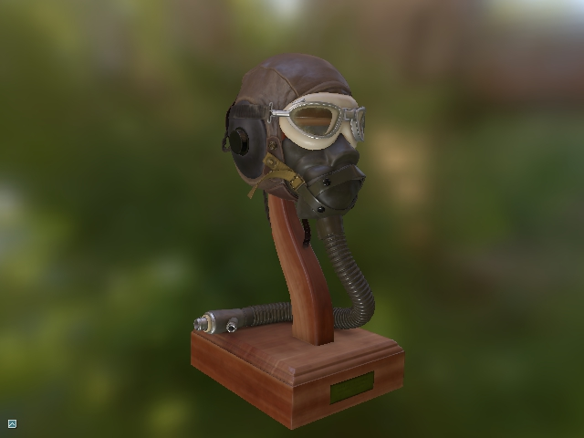

# Asset Loader

The asset loading libary currently supports GLTF 2.0 format.

## GLTF 2.0



GLTF loader uses [tiny gltf](https://github.com/syoyo/tinygltf) library and is based on
[Vulkan-glTF-PBR](https://github.com/SaschaWillems/Vulkan-glTF-PBR) project by [Sascha Willems](https://github.com/SaschaWillems).

The loader supports most of the major GLTF2.0 features:

* [x] ASCII, Binary, and Embedded GLTF specifications
* [x] PBR Materials (Metallic-Roughness and Specular-Glossiness workflows)
* [x] Animations (skinned and articulated)

Note that the loader does not implement all aspects of the standard. 

The loading functionality is implemented in `Diligent::GLTF::Model` class
that initializes all Diligent Engine objects required to render the model.

```cpp
std::unique_ptr<GLTF::Model> Model;
Model.reset(new GLTF::Model(pDevice, pImmediateContext, "models/DamagedHelmet/DamagedHelmet.gltf"));
```

The loader does have any rendering capabilities. Please see
[Diligent GLTF PBR Renderer](https://github.com/DiligentGraphics/DiligentFX/tree/master/GLTF_PBR_Renderer).

## References

[GLTF2.0 Format Specification](https://github.com/KhronosGroup/glTF)

[Vulkan-glTF-PBR](https://github.com/SaschaWillems/Vulkan-glTF-PBR)

[tinygltf](https://github.com/syoyo/tinygltf)
