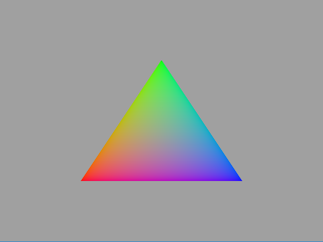

# Asteroids

This app is designed to be a performance benchmark and is based on 
[this demo](https://software.intel.com/en-us/articles/asteroids-and-directx-12-performance-and-power-savings) developed by Intel. 
It renders 50,000 unique textured asteroids. Every asteroid is a combination of one of 1000 unique 
meshes and one of 10 unique textures. The demo uses original D3D11 and D3D12 native implementations, 
and adds implementation using Diligent Engine API to allow comparing performance of different rendering modes.

# Build and Run Instructions

The demo only supports Win32/x64 configuration. To build the project, follow
[these instructions](https://github.com/DiligentGraphics/DiligentEngine#win32).

# Controlling the demo

Use the following keys to control the demo:

* 'm' - toggle multithreaded rendering
* '+' - increase the number of threads
* '-' - decrease the number of threads
* '1' - Use native D3D11 rendering mode
* '2' - Use native D3D12 rendering mode
* '3' - Use Diligent Engine D3D11 rendering mode
* '4' - Use Diligent Engine D3D12 rendering mode
* '5' - Use Diligent Engine Vulkan rendering mode
