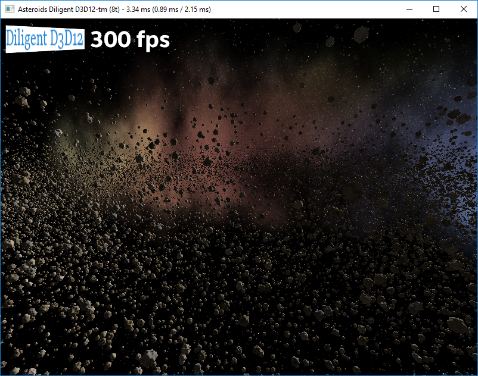
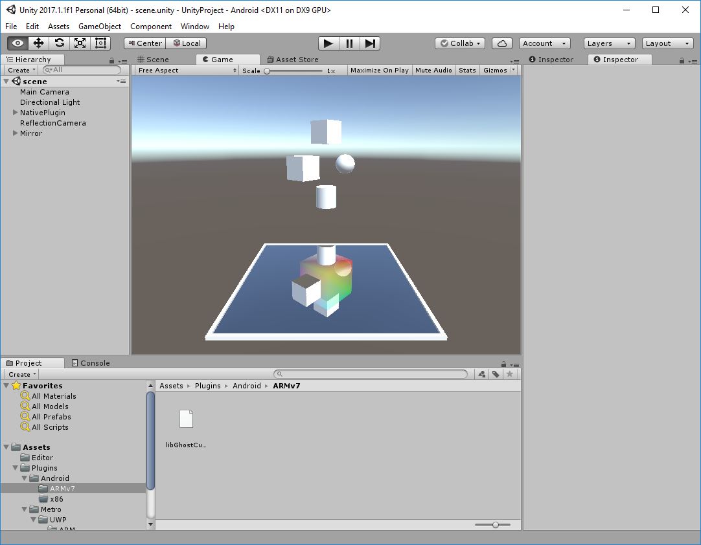

# Diligent Engine 
**A Modern Cross-Platform Low-Level 3D Graphics Library** [](https://twitter.com/intent/tweet?text=An%20easy-to-use%20cross-platform%20graphics%20library%20that%20takes%20full%20advantage%20of%20%23Direct3D12%20and%20%23VulkanAPI&url=https://github.com/DiligentGraphics/DiligentEngine)

[Diligent Engine](http://diligentgraphics.com/diligent-engine/) is a lightweight cross-platform graphics
API abstraction library. It is designed to take full advantage of Direct3D12, Vulkan and Metal, while
supporting older platforms via Direct3D11, OpenGL and OpenGLES. Diligent Engine exposes common front-end 
API and uses HLSL as universal shading language on all platforms and rendering back-ends. Platform-specific 
shader representations (GLSL, DX bytecode or SPIRV) can be used with corresponding back-ends.
The engine is intended to be used as graphics subsystem in a game engine or any other 3D application. 
It is distributed under [Apache 2.0 license](License.txt) and is free to use.

[](License.txt)
[](https://gitter.im/diligent-engine)
[](https://ci.appveyor.com/project/DiligentGraphics/diligentengine)
[](https://travis-ci.org/DiligentGraphics/DiligentEngine)

## Features

* Cross-platform
  * Exact same client code for all supported platforms and rendering backends
    * No `#if defined(_WIN32)` ... `#elif defined(LINUX)` ... `#elif defined(ANDROID)` ...
    * No `#if defined(D3D11)` ... `#elif defined(D3D12)` ... `#elif defined(OPENGL)` ...
  * Exact same HLSL shaders run on all platforms and all back-ends 
* High performance
* Modular design
  * Components are clearly separated logically and physically and can be used as needed
  * Only take what you need for your project
* Clear object-based interface
  * No hidden global states
* Key graphics features:
  * Automatic shader resource binding designed to leverage next-generation graphics APIs
  * Multithreaded command buffer generation
    * [50,000 draw calls at 300 fps](https://github.com/DiligentGraphics/DiligentEngine/tree/master/Projects/Asteroids) with D3D12/Vulkan backend
  * Descriptor, memory and resource state management
* Modern c++ features to make code fast and reliable

## Supported Plaforms and Low-Level Graphics APIs

| Platform                     | APIs                                        |  Build Status    |
| ---------------------------- | ------------------------------------------- | ---------------- | 
|  Win32 (Windows desktop)| Direct3D11, Direct3D12, OpenGL4.2+, Vulkan     | [](https://ci.appveyor.com/project/DiligentGraphics/diligentengine) |
|  Universal Windows     | Direct3D11, Direct3D12                         | [](https://ci.appveyor.com/project/DiligentGraphics/diligentengine) |
|  Linux                    | OpenGL4.2+, Vulkan                             | [](https://travis-ci.org/DiligentGraphics/DiligentEngine)      |
|  Android                | OpenGLES3.0+                                   |																																					    |
|  MacOS                    | OpenGL4.1, Vulkan (via [MoltenVK](https://github.com/KhronosGroup/MoltenVK)) | [](https://travis-ci.org/DiligentGraphics/DiligentEngine) |
|  iOS                      | OpenGLES3.0                                    | [](https://travis-ci.org/DiligentGraphics/DiligentEngine)      |

Last Stable Release - [v2.4](https://github.com/DiligentGraphics/DiligentEngine/releases/tag/v2.4)

# Table of Contents

- [Clonning the Repository](#clonning)
  - [Repository Structure](#repository_structure)
- [Build and Run Instructions](#build_and_run)
  - [Win32](#build_and_run_win32)
  - [Universal Windows Platform](#build_and_run_uwp)
  - [Linux](#build_and_run_linux)
  - [Android](#build_and_run_android)
  - [MacOS](#build_and_run_macos)
  - [iOS](#build_and_run_ios)
  - [Integrating Diligent Engine with Existing Build System](#build_and_run_integration)
  - [Customizing Build](#build_and_run_customizing)
- [Getting started with the API](#getting_started)
- [Tutorials](#tutorials)
- [Samples](#samples)
- [Demos](#demos)
- [Contributing](#contributing)
- [References](#references)
- [Releas History](#release_history)

<a name="clonning"></a>
# Cloning the Repository

This is the master repository that contains three [submodules](https://git-scm.com/book/en/v2/Git-Tools-Submodules). To get the repository and all submodules, use the following command:

```
git clone --recursive https://github.com/DiligentGraphics/DiligentEngine.git
```

Alternatively, you can get master repository fisrt, and then individually clone all submodules into the engine's root folder.
 
To checkout the last stable release, run the following commands:

```
git checkout tags/v2.4
git submodule update --init --recursive
```

<a name="repository_structure"></a>
## Repository Structure

Master repository includes the following submodules:

* [Core](https://github.com/DiligentGraphics/DiligentCore) submodule implements 
  [Direct3D11](https://github.com/DiligentGraphics/DiligentCore/tree/master/Graphics/GraphicsEngineD3D11), 
  [Direct3D12](https://github.com/DiligentGraphics/DiligentCore/tree/master/Graphics/GraphicsEngineD3D12),
  [OpenGL/GLES](https://github.com/DiligentGraphics/DiligentCore/tree/master/Graphics/GraphicsEngineOpenGL), and
  [Vulkan](https://github.com/DiligentGraphics/DiligentCore/tree/master/Graphics/GraphicsEngineVulkan) back-ends.
  The module is self-contained and can be built by its own.
* [Tools](https://github.com/DiligentGraphics/DiligentTools) submodule contains 
  [texture loading library](https://github.com/DiligentGraphics/DiligentTools/tree/master/TextureLoader) and 
  [Render Script](https://github.com/DiligentGraphics/DiligentTools/tree/master/RenderScript), a Lua-based run-time 
  graphics resource managing system. Tools module depends on Core module.
* [Samples](https://github.com/DiligentGraphics/DiligentSamples) submodule contains several simple graphics applications 
  intended to demonstrate the usage of the Diligent Engine API. The module depends on Core and Tools modules.
  

<a name="build_and_run"></a>
# Build and Run Instructions

Diligent Engine uses [CMake](https://cmake.org/) as a cross-platform build tool. 
To start using cmake, download the [latest release](https://cmake.org/download/) (3.13 or later is required).
Another build prerequisite is [Python interpreter](https://www.python.org/downloads/).

<a name="build_and_run_win32"></a>
## Win32

To generate build files for Windows desktop platform, use either CMake GUI or command line tool. For example, to generate 
[Visual Studio 2017](https://www.visualstudio.com/vs/community) 64-bit solution and project files in *cmk_build/Win64* folder, 
navigate to the engine's root folder and run the following command:

```
cmake -H. -B./cmk_build/Win64 -G "Visual Studio 15 2017 Win64"
```

You can generate Win32 solution that targets Win8.1 SDK using the following command:

```
cmake -D CMAKE_SYSTEM_VERSION=8.1 -H. -B./cmk_build/Win64 -G "Visual Studio 15 2017 Win64"
```

If you use MinGW, you can generate the make files using the command below:

```
cmake -H. -B./cmk_build/MinGW -G "MinGW Makefiles"
```

**WARNING!** In current implementation, full path to cmake build folder **must not contain white spaces**.

To enable Vulkan validation layers, you will need to download [Vulkan SDK](https://www.lunarg.com/vulkan-sdk/) and add environemt
variable `VK_LAYER_PATH` that contains path to the *Bin* directory in VulkanSDK installation folder.

Make sure that Visual C++ ATL Support is installed via Visual Studio Installer.

Open *DiligentEngine.sln* file in *cmk_build/Win64* folder, select configuration and build the engine. Set the desired project
as startup project (by default, Asteroids demo will be selected) and run it. 

By default, sample and tutorial applications will show rendering backend selection dialog box. Use the following command line options to force
D3D11, D3D12, OpenGL, or Vulkan mode: **mode=D3D11**, **mode=D3D12**, **mode=GL**, or **mode=Vk** (do not use spaces!). If you want to run an application
outside of Visual Studio environment, the application's assets folder must be set as working directory. (For Visual Studio, this 
is automatically configured by CMake). Alternatively, you can navigate to the build target or install folder and run the executable from there.


<a name="build_and_run_uwp"></a>
## Universal Windows Platform

To generate build files for Universal Windows platform, you need to define the following two cmake variables:

* `CMAKE_SYSTEM_NAME=WindowsStore`
* `CMAKE_SYSTEM_VERSION=< Windows SDK Version >`

For example, to generate Visual Studio 2017 64-bit solution and project files in *cmk_build/UWP64* folder, run the following command
from the engine's root folder:

```
cmake -D CMAKE_SYSTEM_NAME=WindowsStore -D CMAKE_SYSTEM_VERSION=10.0 -H. -B./cmk_build/UWP64 -G "Visual Studio 15 2017 Win64"
```

You can target specific SDK version by refining CMAKE_SYSTEM_VERSION, for instance:

```
cmake -D CMAKE_SYSTEM_NAME=WindowsStore -D CMAKE_SYSTEM_VERSION=10.0.16299.0 -H. -B./cmk_build/UWP64 -G "Visual Studio 15 2017 Win64"
```

Set the desired project as startup project (by default, Atmosphere sample will be selected) and run it. 

By default, appplications will run in D3D12 mode. You can select D3D11 or D3D12 using the following command line options:
**mode=D3D11**, **mode=D3D12** (do not use spaces!).

Note: it is possible to generate solution that targets Windows 8.1 by defining CMAKE_SYSTEM_VERSION=8.1 cmake variable, but it will fail
to build as it will use Visual Studio 2013 (v120) toolset that lacks proper c++11 support.


<a name="build_and_run_linux"></a>
## Linux

Your Linux environment needs to be set up for c++ development. If it already is, make sure your c++ tools are up to date
as Diligent Engine uses modern c++ features (gcc/g++ 7 or later is recommended). You may need to install the following packages:

1. gcc, make and other essential c/c++ tools:

```
sudo apt-get update
sudo apt-get upgrade
sudo apt-get install build-essential
```

2. cmake

```
sudo apt-get install cmake
```

3. Other required packages:

```
sudo apt-get install libx11-dev
sudo apt-get install mesa-common-dev
sudo apt-get install mesa-utils
sudo apt-get install libgl-dev
```

To configure Vulkan you will also need to:

* Install latest Vulkan drivers and libraries for your GPU
* Install [Vulkan SDK](https://www.lunarg.com/vulkan-sdk/)
  * To make sure that you system is properly configured you can try to build and run samples from the SDK

To generate make files for debug configuration, run the following CMake command from the engine's root folder:

```
cmake -H. -B./cmk_build/Linux64 -G "Unix Makefiles" -DCMAKE_BUILD_TYPE="Debug"
```

To build the engine, run the following command:

```
cmake --build ./cmk_build/Linux64
```

The engine's root folder contains [Visual Studio Code](https://code.visualstudio.com/) settings files that configure
the IDE to build the engine. You can run applications directly from the IDE. To run an application from the command line,
the app's assets folder must be current directory.


<a name="build_and_run_android"></a>
## Android

Please make sure that your machine is set up for Android development. Download 
[Android Studio](https://developer.android.com/studio/index.html), [Android NDK](https://developer.android.com/ndk/downloads/index.html) and
other required tools. To verify that your environment is properly set up, try building 
[teapots sample](https://github.com/googlesamples/android-ndk/tree/master/teapots).

Open *DiligentSamples/Android* or *UnityPlugin/Android* folders with Android Studio to build and run
the engine samples and Unity emulator on Android.


<a name="build_and_run_macos"></a>
## MacOS

After you clone the repo, run the following command from the engine's root folder to generate Xcode project
(you need to have [CMake](https://cmake.org/) installed on the system):

```
cmake -H. -B./cmk_build/MacOS -G "Xcode"
```

Open Xcode project file in cmk_build/MacOS folder to build the engine and run the applications. 


<a name="build_and_run_ios"></a>
## iOS

Run the command below from the engine's root folder to generate Xcode project configured for iOS build
(you need to have [CMake](https://cmake.org/) installed on your Mac):

```
cmake -DCMAKE_TOOLCHAIN_FILE=DiligentCore/ios.toolchain.cmake -DIOS_PLATFORM=OS64 -H. -Bcmk_build/IOS -GXcode
```

Open Xcode project file in *cmk_build/IOS* folder and build the engine. To run the applications on an iOS device,
you will need to set an appropriate development team in the project settings.


<a name="build_and_run_integration"></a>
## Integrating Diligent Engine with Existing Build System

If your project uses CMake, adding Diligent Engine requires just few lines of code. 
Suppose that the directory structure looks like this:

```
|
+-DiligentCore
+-HelloDiligent.cpp
```

Then the following steps need to be done:
* Call `add_subdirectory(DiligentCore)`
* Add *DiligentCore* to the list of include directories
* Add dependencies on the targets implementing required rendering backends

Below is an example of a CMake file:

```cmake
cmake_minimum_required (VERSION 3.6)

project(HelloDiligent CXX)

add_subdirectory(DiligentCore)

add_executable(HelloDiligent WIN32 HelloDiligent.cpp)
target_compile_options(HelloDiligent PRIVATE -DUNICODE -DENGINE_DLL)
target_include_directories(HelloDiligent PRIVATE "DiligentCore")

add_dependencies(HelloDiligent
    GraphicsEngineD3D11-shared
    GraphicsEngineOpenGL-shared
    GraphicsEngineD3D12-shared
    GraphicsEngineVk-shared
)
copy_required_dlls(HelloDiligent)
```

`copy_required_dlls()` is a convenience function that copies shared libraries next to
the executable so that the system can find and load them. Alternatively, you can link against 
static (as well as shared) versions of libraries using `target_link_libraries()` command. In this case 
there is no need to explicitly add *DiligentCore* to the list of include directories as the targets export
all required include paths.
Please also take a look at getting started tutorials for 
[Windows](https://github.com/DiligentGraphics/DiligentSamples/tree/master/Tutorials/Tutorial00_HelloWin32) and 
[Linux](https://github.com/DiligentGraphics/DiligentSamples/tree/master/Tutorials/Tutorial00_HelloLinux).

If your project does not use CMake, it is recommended to build libraries with cmake and add them to your build system.
To install libraries and header files, run the following CMake command from the build folder:

```cmake
cmake --build . --target install
```

To change installation folder, set `DILIGENT_CORE_INSTALL_DIR` cmake variable.

Alternatively you can generate build files (such as Visual Studio projects) and add them to your project.
Build customization described below can help tweak the settings for your specific needs.


<a name="build_and_run_customizing"></a>
## Customizing Build

Diligent Engine allows clients to customize build settings by providing configuration script file that defines two optional 
[cmake functions](https://cmake.org/cmake/help/v3.13/command/function.html):

* `custom_configure_build()` - defines global build properties such as build configurations, c/c++ compile flags, link flags etc.
* `custom_configure_target()` - defines custom settings for every target in the build.

The path to the configuration script should be provided through `BUILD_CONFIGURATION_FILE` variable when running 
cmake and must be relative to the cmake root folder, for example:

```
cmake -D BUILD_CONFIGURATION_FILE=BuildConfig.cmake -H. -B./cmk_build/Win64 -G "Visual Studio 15 2017 Win64"
```

### Customizing global build settings with custom_configure_build() function

If defined, `custom_configure_build()` function is called before any build target is added. By default,
cmake defines the following four configurations: Debug, Release, RelWithDebInfo, MinSizeRel. If you want, 
you can define your own build configurations by setting `CMAKE_CONFIGURATION_TYPES` variable. For instance,
if you want to have only two configuration: Debug and ReleaseMT, add the following line to the `custom_configure_build()`
function:

```cmake
set(CMAKE_CONFIGURATION_TYPES Debug ReleaseMT CACHE STRING "Configuration types: Debug, ReleaseMT" FORCE)
```

The build system needs to know the list of debug and release (optimized) configurations, so the following
two variables must also be set when `CMAKE_CONFIGURATION_TYPES` variable is defined:

```cmake
set(DEBUG_CONFIGURATIONS DEBUG CACHE INTERNAL "" FORCE)
set(RELEASE_CONFIGURATIONS RELEASEMT CACHE INTERNAL "" FORCE)
```

Note that due to cmake specifics, configuration names listed in `DEBUG_CONFIGURATIONS` and `RELEASE_CONFIGURATIONS`
**must be capitalized**.

If you define any configuration other than four standard cmake ones, you also need to set the following variables, for every
new configuration:

* `CMAKE_C_FLAGS_<Config>` - c compile flags
* `CMAKE_CXX_FLAGS_<Config>` - c++ compile flags
* `CMAKE_EXE_LINKER_FLAGS_<Config>` - executable link flags
* `CMAKE_SHARED_LINKER_FLAGS_<Config>` - shared library link flags

For instance:

```cmake
set(CMAKE_C_FLAGS_RELEASEMT "/MT" CACHE INTERNAL "" FORCE)
set(CMAKE_CXX_FLAGS_RELEASEMT "/MT" CACHE INTERNAL "" FORCE)
set(CMAKE_EXE_LINKER_FLAGS_RELEASEMT "/OPT:REF" CACHE INTERNAL "" FORCE)
set(CMAKE_SHARED_LINKER_FLAGS_RELEASEMT "/OPT:REF" CACHE INTERNAL "" FORCE)
```

Below is an example of custom_configure_build() function:

```cmake
function(custom_configure_build)
    if(CMAKE_CONFIGURATION_TYPES)
        # Debug configurations
        set(DEBUG_CONFIGURATIONS DEBUG CACHE INTERNAL "" FORCE)
        # Release (optimized) configurations
        set(RELEASE_CONFIGURATIONS RELEASEMT CACHE INTERNAL "" FORCE)
        # CMAKE_CONFIGURATION_TYPES variable defines build configurations generated by cmake
        set(CMAKE_CONFIGURATION_TYPES Debug ReleaseMT CACHE STRING "Configuration types: Debug, ReleaseMT" FORCE)

        set(CMAKE_CXX_FLAGS_RELEASEMT "/MT" CACHE INTERNAL "" FORCE)
        set(CMAKE_C_FLAGS_RELEASEMT "/MT" CACHE INTERNAL "" FORCE)
        set(CMAKE_EXE_LINKER_FLAGS_RELEASEMT "/OPT:REF" CACHE INTERNAL "" FORCE)
        set(CMAKE_SHARED_LINKER_FLAGS_RELEASEMT "/OPT:REF" CACHE INTERNAL "" FORCE)
    endif()
endfunction()
```


### Customizing individual target build settings with custom_configure_target() function

If defined, `custom_configure_target()` is called for every target created by the build system and
allows configuring target-specific properties.

By default, the build system sets some target properties. If `custom_configure_target()` sets all required properties,
it can tell the build system that no further processing is required by setting `TARGET_CONFIGURATION_COMPLETE`
[parent scope](https://cmake.org/cmake/help/v3.13/command/set.html#set-normal-variable) variable to `TRUE`:

```cmake
set(TARGET_CONFIGURATION_COMPLETE TRUE PARENT_SCOPE)
```

The following is an example of `custom_configure_target()` function:

```cmake
function(custom_configure_target TARGET)
    set_target_properties(${TARGET} PROPERTIES
        STATIC_LIBRARY_FLAGS_RELEASEMT /LTCG
    )
    set(TARGET_CONFIGURATION_COMPLETE TRUE PARENT_SCOPE)   
endfunction()
```

<a name="getting_started"></a>
# Getting started with the API

Please refer to [this page](https://github.com/DiligentGraphics/DiligentCore#api-basics). Also, tutorials and samples listed below is a good place to start.


<a name="tutorials"></a>
# [Tutorials](https://github.com/DiligentGraphics/DiligentSamples/tree/master/Tutorials)

| Tutorial   | Screenshot  | Description          |
|------------|-------------|----------------------|
| [01 - Hello Triangle](https://github.com/DiligentGraphics/DiligentSamples/blob/master/Tutorials/Tutorial01_HelloTriangle) |  | This tutorial shows how to render simple triangle using Diligent Engine API. |
| [02 - Cube](https://github.com/DiligentGraphics/DiligentSamples/blob/master/Tutorials/Tutorial02_Cube) |  | This tutorial demonstrates how to render an actual 3D object, a cube. It shows how to load shaders from files, create and use vertex, index and uniform buffers. |
| [03 - Texturing](https://github.com/DiligentGraphics/DiligentSamples/blob/master/Tutorials/Tutorial03_Texturing) |  | This tutorial demonstrates how to apply a texture to a 3D object. It shows how to load a texture from file, create shader resource binding object and how to sample a texture in the shader. |
| [04 - Instancing](https://github.com/DiligentGraphics/DiligentSamples/blob/master/Tutorials/Tutorial04_Instancing) |  | This tutorial demonstrates how to use instancing to render multiple copies of one object using unique transformation matrix for every copy. |
| [05 - Texture Array](https://github.com/DiligentGraphics/DiligentSamples/blob/master/Tutorials/Tutorial05_TextureArray) |  | This tutorial demonstrates how to combine instancing with texture arrays to use unique texture for every instance. |
| [06 - Multithreading](https://github.com/DiligentGraphics/DiligentSamples/blob/master/Tutorials/Tutorial06_Multithreading) |  | This tutorial shows how to generate command lists in parallel from multiple threads. |
| [07 - Geometry Shader](https://github.com/DiligentGraphics/DiligentSamples/blob/master/Tutorials/Tutorial07_GeometryShader) |  | This tutorial shows how to use geometry shader to render smooth wireframe. |
| [08 - Tessellation](https://github.com/DiligentGraphics/DiligentSamples/blob/master/Tutorials/Tutorial08_Tessellation) |  | This tutorial shows how to use hardware tessellation to implement simple adaptive terrain rendering algorithm. |
| [09 - Quads](https://github.com/DiligentGraphics/DiligentSamples/blob/master/Tutorials/Tutorial09_Quads) |  | This tutorial shows how to render multiple 2D quads, frequently swithcing textures and blend modes. |
| [10 - Data Streaming](https://github.com/DiligentGraphics/DiligentSamples/blob/master/Tutorials/Tutorial10_DataStreaming) |  | This tutorial shows dynamic buffer mapping strategy using `MAP_FLAG_DISCARD` and `MAP_FLAG_DO_NOT_SYNCHRONIZE` flags to efficiently stream varying amounts of data to GPU. |
| [11 - Resource Updates](https://github.com/DiligentGraphics/DiligentSamples/tree/master/Tutorials/Tutorial11_ResourceUpdates) |  | This tutorial demonstrates different ways to update buffers and textures in Diligent Engine and explains important internal details and performance implications related to each method. |


<a name="samples"></a>
# [Samples](https://github.com/DiligentGraphics/DiligentSamples)

| Sample     | Screenshot  | Description          |
|------------|-------------|----------------------|
| [AntTweakBar Sample](https://github.com/DiligentGraphics/DiligentSamples/tree/master/Samples/AntTweakBar) |  | This sample demonstrates how to use [AntTweakBar library](http://anttweakbar.sourceforge.net/doc) to create simple user interface. |
| [Atmosphere Sample](https://github.com/DiligentGraphics/DiligentSamples/tree/master/Samples/Atmosphere) |  | The sample implements physically-based atmospheric light scattering model and demonstrates how Diligent Engine can be used to accomplish various rendering tasks: loading textures from files, using complex shaders, rendering to textures, using compute shaders and unordered access views, etc. |


<a name="demos"></a>
# Demos

| Project    | Screenshot  | Description          |
|------------|-------------|----------------------|
| [Asteroids Performance Benchmark](https://github.com/DiligentGraphics/DiligentEngine/tree/master/Projects/Asteroids) |  | This demo is designed to be a performance benchmark and is based on [this demo](https://software.intel.com/en-us/articles/asteroids-and-directx-12-performance-and-power-savings) developed by Intel. It renders 50,000 unique textured asteroids. Every asteroid is a combination of one of 1000 unique meshes and one of 10 unique textures. The sample uses original D3D11 and D3D12 native implementations, and adds implementation using Diligent Engine API to allow comparing performance of different rendering modes. |
| [Unity Integration Demo](https://github.com/DiligentGraphics/DiligentEngine/tree/master/unityplugin) |  | This project demonstrates integration of Diligent Engine with Unity |


<a name="contributing"></a>
# Contributing

To contribute your code, submit a [Pull Request](https://github.com/DiligentGraphics/DiligentEngine/pulls) 
to this repository. **Diligent Engine** is licensed under the [Apache 2.0 license](License.txt) that guarantees 
that code in the **DiligentEngine** repository is free of Intellectual Property encumbrances. In submitting code to
this repository, you are agreeing that the code is free of any Intellectual Property claims.  


<a name="references"></a>
# References

[API Reference](https://cdn.rawgit.com/DiligentGraphics/DiligentCore/4949ec8a/doc/html/index.html)


<a name="release_history"></a>
# Release History

See [Release History](ReleaseHistory.md)

------------------------------

[diligentgraphics.com](http://diligentgraphics.com)

[](https://twitter.com/diligentengine)
[](https://www.facebook.com/DiligentGraphics/)
